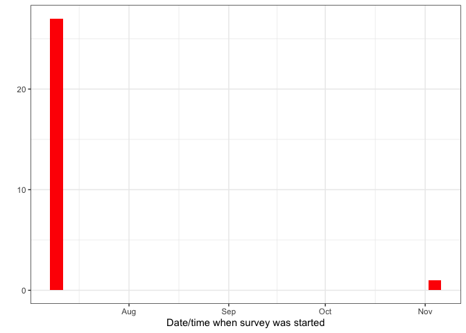
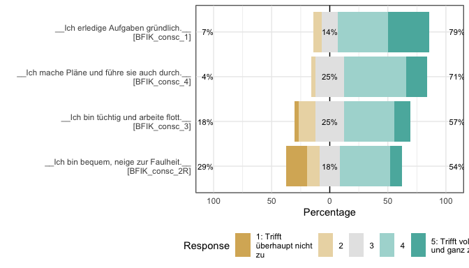
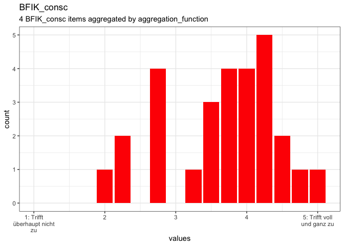
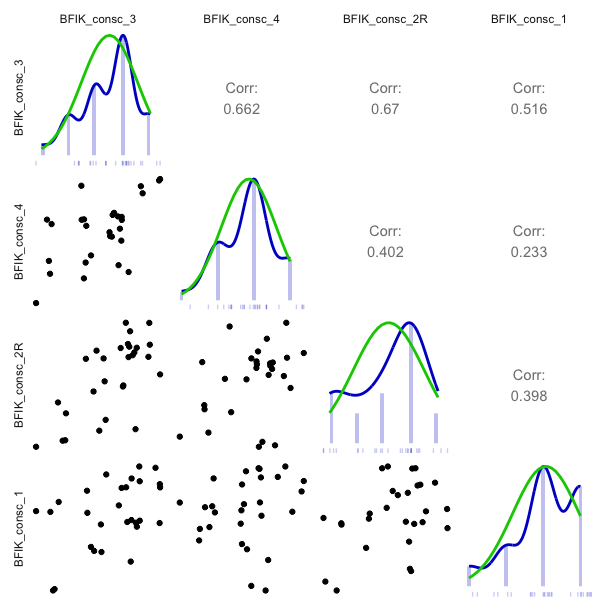
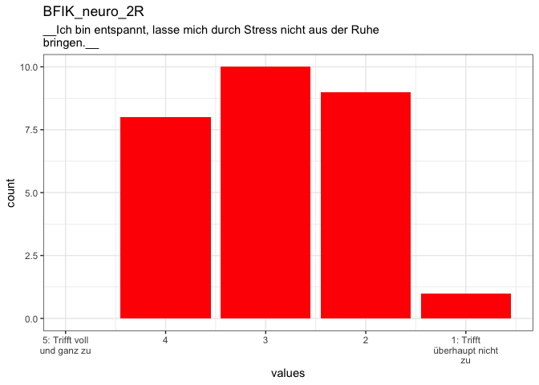
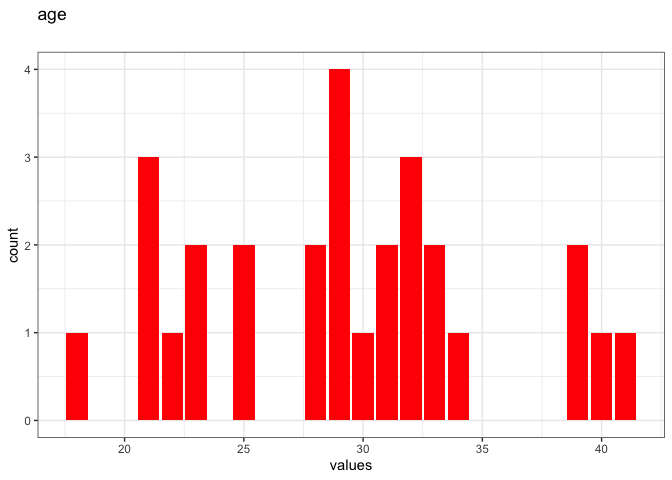

```r
knitr::opts_chunk$set(warning = TRUE, message = TRUE, echo = FALSE, error = TRUE)

library(codebook)
library(dplyr)
#> 
#> Attaching package: 'dplyr'
#> The following objects are masked from 'package:stats':
#> 
#>     filter, lag
#> The following objects are masked from 'package:base':
#> 
#>     intersect, setdiff, setequal, union
data("bfi", package = 'codebook')
bfi <- bfi %>% select(-starts_with("BFIK_extra"),
                       -starts_with("BFIK_agree"),
                       -starts_with("BFIK_open"),
                       -starts_with("BFIK_neuro"),
                      BFIK_neuro_2R)

ggplot2::theme_set(ggplot2::theme_bw())

bfi$age <- rpois(nrow(bfi), 30)
library(ggplot2)
update_geom_defaults("bar", new = list(fill = "red"))
options(ggplot2.continuous.colour="viridis")
```


```
#> Registered S3 method overwritten by 'GGally':
#>   method from   
#>   +.gg   ggplot2
#> Loading required namespace: GPArotation
```


### Metadata

#### Description
__Dataset name__: bfi

The dataset has N=28 rows and 12 columns.
0 rows have no missing values on any column.

<details>
<summary title="Expand this section to see some additional metadata in a structured format that is useful for search engines">Metadata for search engines</summary>


- __Date published__: 2020-06-05


<table class="kable_wrapper">
<tbody>
  <tr>
   <td> 

|x             |
|:-------------|
|session       |
|created       |
|modified      |
|ended         |
|expired       |
|BFIK_consc_3  |
|BFIK_consc_4  |
|BFIK_consc_2R |
|BFIK_consc_1  |
|BFIK_consc    |
|BFIK_neuro_2R |
|age           |

 </td>
  </tr>
</tbody>
</table>

</details>


### Survey overview

28 completed rows, 28 who entered any information, 0 only viewed the first page. There are 0 expired rows (people who did not finish filling out in the requested time frame). In total, there are 28 rows including unfinished and expired rows. 


There were 28 unique participants, of which 28 finished filling out at least one survey.

This survey was not repeated.


The first session started on 2016-07-08 09:54:16, the last session on 2016-11-02 21:19:50. 

```
#> `stat_bin()` using `bins = 30`. Pick better value with `binwidth`.
```

<!-- -->

People took on average 127.36 minutes (median 1.48) to answer the survey.

```
#> Warning: Durations below 0 detected.
#> Warning: Removed 4 rows containing non-finite values (stat_bin).
#> Warning: Removed 2 rows containing missing values (geom_bar).
```

<!-- -->


## Variables


### Scale: BFIK_consc {#BFIK_consc .tabset}
<a name="BFIK_consc_3"></a><a name="BFIK_consc_4"></a><a name="BFIK_consc_2R"></a><a name="BFIK_consc_1"></a>

#### Overview {#BFIK_consc_likert}

__Reliability__: ω<sub>ordinal</sub> [95% CI] = 0.61 [0.38;0.84].

__Missing__: 0.


<!-- -->


<!-- -->

#### Reliability details {#BFIK_consc_reliability}

```
#> No viewer found, probably documenting or testing
```


### Scale diagnosis


#### Reliability (internal consistency) estimates


##### Scale structure


###### Information about this scale

                                                                                             
----------------------------------  ---------------------------------------------------------
Dataframe:                          res$dat                                                  
Items:                              BFIK_consc_3, BFIK_consc_4, BFIK_consc_2R & BFIK_consc_1 
Observations:                       28                                                       
Positive correlations:              6                                                        
Number of correlations:             6                                                        
Percentage positive correlations:   100                                                      
----------------------------------  ---------------------------------------------------------


###### Estimates assuming interval level

                                   
----------------------------  -----
Omega (total):                 0.81
Omega (hierarchical):          0.24
Revelle's Omega (total):       0.37
Greatest Lower Bound (GLB):    0.90
Coefficient H:                 1.00
Coefficient Alpha:             0.78
----------------------------  -----


####### Confidence intervals

                                 
------------------  -------------
Omega (total):      [0.7; 0.92]  
Coefficient Alpha   [0.65; 0.91] 
------------------  -------------


###### Estimates assuming ordinal level

                                  
---------------------------  -----
Ordinal Omega (total):        0.61
Ordinal Omega (hierarch.):    0.59
Ordinal Coefficient Alpha:    0.59
---------------------------  -----


####### Confidence intervals

                                         
--------------------------  -------------
Ordinal Omega (total):      [0.38; 0.84] 
Ordinal Coefficient Alpha   [0.34; 0.84] 
--------------------------  -------------


Note: the normal point estimate and confidence interval for omega are based on the procedure suggested by Dunn, Baguley & Brunsden (2013) using the MBESS function ci.reliability, whereas the psych package point estimate was suggested in Revelle & Zinbarg (2008). See the help ('?ufs::scaleStructure') for more information.


#### Eigen values

2.473, 0.777, 0.539 & 0.211

#### Factor analysis (reproducing only shared variance)

                   ML1
--------------  ------
BFIK_consc_3     0.997
BFIK_consc_4     0.663
BFIK_consc_2R    0.672
BFIK_consc_1     0.517


#### Component analysis (reproducing full covariance matrix)

                   PC1
--------------  ------
BFIK_consc_3     0.926
BFIK_consc_4     0.738
BFIK_consc_2R    0.800
BFIK_consc_1     0.657


#### Item descriptives

                mean               median   var                 sd                  IQR   se                  min   q1   q3   max   skew                 kurt                 dip                  n    NA   valid 
--------------  -----------------  -------  ------------------  ------------------  ----  ------------------  ----  ---  ---  ----  -------------------  -------------------  -------------------  ---  ---  ------
BFIK_consc_3    3.5                4        1.07407407407407    1.0363754503432     1     0.195856550464334   1     3    5    5     -0.537478167332475   -0.12604774535809    0.125                28   0    28    
BFIK_consc_4    3.85714285714286   4        0.571428571428571   0.755928946018454   1     0.142857142857143   2     3    5    5     -0.30527899743053    0.0658119658119646   0.125                28   0    28    
BFIK_consc_2R   3.17857142857143   4        1.70767195767196    1.30677923065526    2     0.24695806162701    1     2    5    5     -0.569450328278411   -0.87511527770092    0.0892857142857143   28   0    28    
BFIK_consc_1    4.07142857142857   4        0.80952380952381    0.899735410842437   1     0.170034010203401   2     3    5    5     -0.804660894445192   0.132211871173808    0.178571428571429    28   0    28    


#### Scattermatrix





#### Summary statistics {#BFIK_consc_summary}

name            label                                           type            type_options   data_type        value_labels                                                                                                                                  optional   item_order    n_missing   complete_rate  min   median   max        mean          sd   n_value_labels  hist     
--------------  ----------------------------------------------  --------------  -------------  ---------------  --------------------------------------------------------------------------------------------------------------------------------------------  ---------  -----------  ----------  --------------  ----  -------  ----  ---------  ----------  ---------------  ---------
BFIK_consc_3    __Ich bin tüchtig und arbeite flott.__          rating_button   5              haven_labelled   1. 1: Trifft überhaupt nicht zu,<br>2. 2,<br>3. 3,<br>4. 4,<br>5. 5: Trifft voll und ganz zu,<br>NA. Item was never rendered for this user.   0          10                    0               1  1     4        5      3.500000   1.0363755                6  ▁▂▁▅▁▇▁▂ 
BFIK_consc_4    __Ich mache Pläne und führe sie auch durch.__   rating_button   5              haven_labelled   1. 1: Trifft überhaupt nicht zu,<br>2. 2,<br>3. 3,<br>4. 4,<br>5. 5: Trifft voll und ganz zu,<br>NA. Item was never rendered for this user.   0          11                    0               1  2     4        5      3.857143   0.7559289                6  ▁▁▃▁▁▇▁▂ 
BFIK_consc_2R   __Ich bin bequem, neige zur Faulheit.__         rating_button   5              haven_labelled   5. 1: Trifft überhaupt nicht zu,<br>4. 2,<br>3. 3,<br>2. 4,<br>1. 5: Trifft voll und ganz zu,<br>NA. Item was never rendered for this user.   0          12                    0               1  1     4        5      3.178571   1.3067792                6  ▃▂▁▃▁▇▁▂ 
BFIK_consc_1    __Ich erledige Aufgaben gründlich.__            rating_button   5              haven_labelled   1. 1: Trifft überhaupt nicht zu,<br>2. 2,<br>3. 3,<br>4. 4,<br>5. 5: Trifft voll und ganz zu,<br>NA. Item was never rendered for this user.   0          18                    0               1  2     4        5      4.071429   0.8997354                6  ▁▁▂▁▁▇▁▇ 


### BFIK_neuro_2R {#BFIK_neuro_2R .tabset}

__Ich bin entspannt, lasse mich durch Stress nicht aus der Ruhe bringen.__

#### Distribution {#BFIK_neuro_2R_distribution}

<!-- -->

0 missing values.

#### Summary statistics {#BFIK_neuro_2R_summary}

name            label                                                                        type            type_options   data_type        optional   item_order    n_missing   complete_rate  min   median   max        mean          sd   n_value_labels  hist     
--------------  ---------------------------------------------------------------------------  --------------  -------------  ---------------  ---------  -----------  ----------  --------------  ----  -------  ----  ---------  ----------  ---------------  ---------
BFIK_neuro_2R   __Ich bin entspannt, lasse mich durch Stress nicht aus der Ruhe bringen.__   rating_button   5              haven_labelled   0          9                     0               1  2     3        5      3.107143   0.8751417                6  ▆▁▇▁▁▇▁▁ 


#### Item {#BFIK_neuro_2R_item}


Table: Item options

name           value                                                                      
-------------  ---------------------------------------------------------------------------
type           rating_button                                                              
type_options   5                                                                          
name           BFIK_neuro_2R                                                              
label          __Ich bin entspannt, lasse mich durch Stress nicht aus der Ruhe bringen.__ 
optional       0                                                                          
class          NULL                                                                       
showif         NULL                                                                       
value          NULL                                                                       
block_order    NULL                                                                       
item_order     9                                                                          


#### Value labels {#BFIK_neuro_2R_labels}

Table: Response choices

name                                      value
---------------------------------------  ------
1: Trifft überhaupt nicht zu                  5
2                                             4
3                                             3
4                                             2
5: Trifft voll und ganz zu                    1
Item was never rendered for this user.       NA


### age {#age .tabset}


#### Distribution {#age_distribution}

<!-- -->

0 missing values.

#### Summary statistics {#age_summary}

name   data_type    n_missing   complete_rate  min   median   max        mean        sd  hist    label 
-----  ----------  ----------  --------------  ----  -------  ----  ---------  --------  ------  ------
age    numeric              0               1  18    29       41     29.21429   6.16055  ▅▃▇▅▃   NA    


## Missingness report

<div data-pagedtable="false">
  <script data-pagedtable-source type="application/json">
{"columns":[{"label":["description"],"name":[1],"type":["chr"],"align":["left"]},{"label":["expired"],"name":[2],"type":["dbl"],"align":["right"]},{"label":["var_miss"],"name":[3],"type":["dbl"],"align":["right"]},{"label":["n_miss"],"name":[4],"type":["dbl"],"align":["right"]}],"data":[{"1":"Missing values in 1 variables","2":"0","3":"1","4":"28"},{"1":"Missing values per variable","2":"28","3":"28","4":"28"}],"options":{"columns":{"min":{},"max":[10]},"rows":{"min":[10],"max":[10]},"pages":{}}}
  </script>
</div>


## Codebook table

<!--html_preserve--><div id="htmlwidget-d01fe0864fcccfa710dc" style="width:100%;height:auto;" class="datatables html-widget"></div>
<script type="application/json" data-for="htmlwidget-d01fe0864fcccfa710dc">{"x":{"filter":"top","filterHTML":"<tr>\n  <td data-type=\"character\" style=\"vertical-align: top;\">\n    <div class=\"form-group has-feedback\" style=\"margin-bottom: auto;\">\n      <input type=\"search\" placeholder=\"All\" class=\"form-control\" style=\"width: 100%;\"/>\n      <span class=\"glyphicon glyphicon-remove-circle form-control-feedback\"><\/span>\n    <\/div>\n  <\/td>\n  <td data-type=\"character\" style=\"vertical-align: top;\">\n    <div class=\"form-group has-feedback\" style=\"margin-bottom: auto;\">\n      <input type=\"search\" placeholder=\"All\" class=\"form-control\" style=\"width: 100%;\"/>\n      <span class=\"glyphicon glyphicon-remove-circle form-control-feedback\"><\/span>\n    <\/div>\n  <\/td>\n  <td data-type=\"character\" style=\"vertical-align: top;\">\n    <div class=\"form-group has-feedback\" style=\"margin-bottom: auto;\">\n      <input type=\"search\" placeholder=\"All\" class=\"form-control\" style=\"width: 100%;\"/>\n      <span class=\"glyphicon glyphicon-remove-circle form-control-feedback\"><\/span>\n    <\/div>\n  <\/td>\n  <td data-type=\"character\" style=\"vertical-align: top;\">\n    <div class=\"form-group has-feedback\" style=\"margin-bottom: auto;\">\n      <input type=\"search\" placeholder=\"All\" class=\"form-control\" style=\"width: 100%;\"/>\n      <span class=\"glyphicon glyphicon-remove-circle form-control-feedback\"><\/span>\n    <\/div>\n  <\/td>\n  <td data-type=\"character\" style=\"vertical-align: top;\">\n    <div class=\"form-group has-feedback\" style=\"margin-bottom: auto;\">\n      <input type=\"search\" placeholder=\"All\" class=\"form-control\" style=\"width: 100%;\"/>\n      <span class=\"glyphicon glyphicon-remove-circle form-control-feedback\"><\/span>\n    <\/div>\n  <\/td>\n  <td data-type=\"character\" style=\"vertical-align: top;\">\n    <div class=\"form-group has-feedback\" style=\"margin-bottom: auto;\">\n      <input type=\"search\" placeholder=\"All\" class=\"form-control\" style=\"width: 100%;\"/>\n      <span class=\"glyphicon glyphicon-remove-circle form-control-feedback\"><\/span>\n    <\/div>\n  <\/td>\n  <td data-type=\"character\" style=\"vertical-align: top;\">\n    <div class=\"form-group has-feedback\" style=\"margin-bottom: auto;\">\n      <input type=\"search\" placeholder=\"All\" class=\"form-control\" style=\"width: 100%;\"/>\n      <span class=\"glyphicon glyphicon-remove-circle form-control-feedback\"><\/span>\n    <\/div>\n  <\/td>\n  <td data-type=\"character\" style=\"vertical-align: top;\">\n    <div class=\"form-group has-feedback\" style=\"margin-bottom: auto;\">\n      <input type=\"search\" placeholder=\"All\" class=\"form-control\" style=\"width: 100%;\"/>\n      <span class=\"glyphicon glyphicon-remove-circle form-control-feedback\"><\/span>\n    <\/div>\n  <\/td>\n  <td data-type=\"character\" style=\"vertical-align: top;\">\n    <div class=\"form-group has-feedback\" style=\"margin-bottom: auto;\">\n      <input type=\"search\" placeholder=\"All\" class=\"form-control\" style=\"width: 100%;\"/>\n      <span class=\"glyphicon glyphicon-remove-circle form-control-feedback\"><\/span>\n    <\/div>\n  <\/td>\n  <td data-type=\"integer\" style=\"vertical-align: top;\">\n    <div class=\"form-group has-feedback\" style=\"margin-bottom: auto;\">\n      <input type=\"search\" placeholder=\"All\" class=\"form-control\" style=\"width: 100%;\"/>\n      <span class=\"glyphicon glyphicon-remove-circle form-control-feedback\"><\/span>\n    <\/div>\n    <div style=\"display: none; position: absolute; width: 200px;\">\n      <div data-min=\"0\" data-max=\"28\"><\/div>\n      <span style=\"float: left;\"><\/span>\n      <span style=\"float: right;\"><\/span>\n    <\/div>\n  <\/td>\n  <td data-type=\"number\" style=\"vertical-align: top;\">\n    <div class=\"form-group has-feedback\" style=\"margin-bottom: auto;\">\n      <input type=\"search\" placeholder=\"All\" class=\"form-control\" style=\"width: 100%;\"/>\n      <span class=\"glyphicon glyphicon-remove-circle form-control-feedback\"><\/span>\n    <\/div>\n    <div style=\"display: none; position: absolute; width: 200px;\">\n      <div data-min=\"0\" data-max=\"1\"><\/div>\n      <span style=\"float: left;\"><\/span>\n      <span style=\"float: right;\"><\/span>\n    <\/div>\n  <\/td>\n  <td data-type=\"disabled\" style=\"vertical-align: top;\">\n    <div class=\"form-group has-feedback\" style=\"margin-bottom: auto;\">\n      <input type=\"search\" placeholder=\"All\" class=\"form-control\" style=\"width: 100%;\"/>\n      <span class=\"glyphicon glyphicon-remove-circle form-control-feedback\"><\/span>\n    <\/div>\n  <\/td>\n  <td data-type=\"disabled\" style=\"vertical-align: top;\">\n    <div class=\"form-group has-feedback\" style=\"margin-bottom: auto;\">\n      <input type=\"search\" placeholder=\"All\" class=\"form-control\" style=\"width: 100%;\"/>\n      <span class=\"glyphicon glyphicon-remove-circle form-control-feedback\"><\/span>\n    <\/div>\n  <\/td>\n  <td data-type=\"character\" style=\"vertical-align: top;\">\n    <div class=\"form-group has-feedback\" style=\"margin-bottom: auto;\">\n      <input type=\"search\" placeholder=\"All\" class=\"form-control\" style=\"width: 100%;\"/>\n      <span class=\"glyphicon glyphicon-remove-circle form-control-feedback\"><\/span>\n    <\/div>\n  <\/td>\n  <td data-type=\"character\" style=\"vertical-align: top;\">\n    <div class=\"form-group has-feedback\" style=\"margin-bottom: auto;\">\n      <input type=\"search\" placeholder=\"All\" class=\"form-control\" style=\"width: 100%;\"/>\n      <span class=\"glyphicon glyphicon-remove-circle form-control-feedback\"><\/span>\n    <\/div>\n  <\/td>\n  <td data-type=\"character\" style=\"vertical-align: top;\">\n    <div class=\"form-group has-feedback\" style=\"margin-bottom: auto;\">\n      <input type=\"search\" placeholder=\"All\" class=\"form-control\" style=\"width: 100%;\"/>\n      <span class=\"glyphicon glyphicon-remove-circle form-control-feedback\"><\/span>\n    <\/div>\n  <\/td>\n  <td data-type=\"character\" style=\"vertical-align: top;\">\n    <div class=\"form-group has-feedback\" style=\"margin-bottom: auto;\">\n      <input type=\"search\" placeholder=\"All\" class=\"form-control\" style=\"width: 100%;\"/>\n      <span class=\"glyphicon glyphicon-remove-circle form-control-feedback\"><\/span>\n    <\/div>\n  <\/td>\n  <td data-type=\"number\" style=\"vertical-align: top;\">\n    <div class=\"form-group has-feedback\" style=\"margin-bottom: auto;\">\n      <input type=\"search\" placeholder=\"All\" class=\"form-control\" style=\"width: 100%;\"/>\n      <span class=\"glyphicon glyphicon-remove-circle form-control-feedback\"><\/span>\n    <\/div>\n    <div style=\"display: none; position: absolute; width: 200px;\">\n      <div data-min=\"3.10714285714286\" data-max=\"29.2142857142857\" data-scale=\"15\"><\/div>\n      <span style=\"float: left;\"><\/span>\n      <span style=\"float: right;\"><\/span>\n    <\/div>\n  <\/td>\n  <td data-type=\"number\" style=\"vertical-align: top;\">\n    <div class=\"form-group has-feedback\" style=\"margin-bottom: auto;\">\n      <input type=\"search\" placeholder=\"All\" class=\"form-control\" style=\"width: 100%;\"/>\n      <span class=\"glyphicon glyphicon-remove-circle form-control-feedback\"><\/span>\n    <\/div>\n    <div style=\"display: none; position: absolute; width: 200px;\">\n      <div data-min=\"0.755928946018454\" data-max=\"6.1605503773917\" data-scale=\"15\"><\/div>\n      <span style=\"float: left;\"><\/span>\n      <span style=\"float: right;\"><\/span>\n    <\/div>\n  <\/td>\n  <td data-type=\"disabled\" style=\"vertical-align: top;\">\n    <div class=\"form-group has-feedback\" style=\"margin-bottom: auto;\">\n      <input type=\"search\" placeholder=\"All\" class=\"form-control\" style=\"width: 100%;\"/>\n      <span class=\"glyphicon glyphicon-remove-circle form-control-feedback\"><\/span>\n    <\/div>\n  <\/td>\n  <td data-type=\"disabled\" style=\"vertical-align: top;\">\n    <div class=\"form-group has-feedback\" style=\"margin-bottom: auto;\">\n      <input type=\"search\" placeholder=\"All\" class=\"form-control\" style=\"width: 100%;\"/>\n      <span class=\"glyphicon glyphicon-remove-circle form-control-feedback\"><\/span>\n    <\/div>\n  <\/td>\n  <td data-type=\"character\" style=\"vertical-align: top;\">\n    <div class=\"form-group has-feedback\" style=\"margin-bottom: auto;\">\n      <input type=\"search\" placeholder=\"All\" class=\"form-control\" style=\"width: 100%;\"/>\n      <span class=\"glyphicon glyphicon-remove-circle form-control-feedback\"><\/span>\n    <\/div>\n  <\/td>\n<\/tr>","extensions":["Buttons"],"data":[["<a href=\"#session\">session<\/a>","<a href=\"#created\">created<\/a>","<a href=\"#modified\">modified<\/a>","<a href=\"#ended\">ended<\/a>","<a href=\"#expired\">expired<\/a>","<a href=\"#BFIK_consc_3\">BFIK_consc_3<\/a>","<a href=\"#BFIK_consc_4\">BFIK_consc_4<\/a>","<a href=\"#BFIK_consc_2R\">BFIK_consc_2R<\/a>","<a href=\"#BFIK_consc_1\">BFIK_consc_1<\/a>","<a href=\"#BFIK_consc\">BFIK_consc<\/a>","<a href=\"#BFIK_neuro_2R\">BFIK_neuro_2R<\/a>","<a href=\"#age\">age<\/a>"],[null,"user first opened survey","user last edited survey","user finished survey",null,"__Ich bin tüchtig und arbeite flott.__","__Ich mache Pläne und führe sie auch durch.__","__Ich bin bequem, neige zur Faulheit.__","__Ich erledige Aufgaben gründlich.__","4 BFIK_consc items aggregated by aggregation_function","__Ich bin entspannt, lasse mich durch Stress nicht aus der Ruhe bringen.__",null],[null,null,null,null,null,"rating_button","rating_button","rating_button","rating_button",null,"rating_button",null],[null,null,null,null,null,"5","5","5","5",null,"5",null],["character","POSIXct","POSIXct","POSIXct","logical","haven_labelled","haven_labelled","haven_labelled","haven_labelled","numeric","haven_labelled","numeric"],[null,null,null,null,null,"1. 1: Trifft überhaupt nicht zu,<br>2. 2,<br>3. 3,<br>4. 4,<br>5. 5: Trifft voll und ganz zu,<br>NA. Item was never rendered for this user.","1. 1: Trifft überhaupt nicht zu,<br>2. 2,<br>3. 3,<br>4. 4,<br>5. 5: Trifft voll und ganz zu,<br>NA. Item was never rendered for this user.","5. 1: Trifft überhaupt nicht zu,<br>4. 2,<br>3. 3,<br>2. 4,<br>1. 5: Trifft voll und ganz zu,<br>NA. Item was never rendered for this user.","1. 1: Trifft überhaupt nicht zu,<br>2. 2,<br>3. 3,<br>4. 4,<br>5. 5: Trifft voll und ganz zu,<br>NA. Item was never rendered for this user.",null,"5. 1: Trifft überhaupt nicht zu,<br>4. 2,<br>3. 3,<br>2. 4,<br>1. 5: Trifft voll und ganz zu,<br>NA. Item was never rendered for this user.",null],[null,null,null,null,null,"0","0","0","0",null,"0",null],[null,null,null,null,null,null,null,null,null,"BFIK_consc_3, BFIK_consc_4, BFIK_consc_2R, BFIK_consc_1",null,null],[null,null,null,null,null,"10","11","12","18",null,"9",null],[0,0,0,0,28,0,0,0,0,0,0,0],[1,1,1,1,0,1,1,1,1,1,1,1],[28,28,28,28,null,null,null,null,null,null,null,null],[0,null,null,null,null,null,null,null,null,null,null,null],[null,null,null,null,": ",null,null,null,null,null,null,null],["64","2016-07-08 09:54:16","2016-07-08 09:55:43","2016-07-08 09:55:43",null,"1","2","1","2"," 2","2","18"],[null,"2016-07-08 12:47:07","2016-07-08 14:23:22","2016-07-08 14:23:22",null,"4","4","4","4"," 3.8","3","29.0"],["64","2016-11-02 21:19:50","2016-11-02 21:21:53","2016-11-02 21:21:53",null,"5","5","5","5"," 5","5","41"],[null,null,null,null,null,3.5,3.85714285714286,3.17857142857143,4.07142857142857,3.65178571428571,3.10714285714286,29.2142857142857],[null,null,null,null,null,1.0363754503432,0.755928946018454,1.30677923065526,0.899735410842437,0.791562232042287,0.875141711880434,6.16055037739169],[0,null,null,null,null,null,null,null,null,null,null,null],[null,null,null,null,null,6,6,6,6,null,6,null],[null,null,null,null,null,"▁▂▁▅▁▇▁▂","▁▁▃▁▁▇▁▂","▃▂▁▃▁▇▁▂","▁▁▂▁▁▇▁▇","▂▃▇▇▃","▆▁▇▁▁▇▁▁","▅▃▇▅▃"]],"container":"<table class=\"display\">\n  <thead>\n    <tr>\n      <th>name<\/th>\n      <th>label<\/th>\n      <th>type<\/th>\n      <th>type_options<\/th>\n      <th>data_type<\/th>\n      <th>value_labels<\/th>\n      <th>optional<\/th>\n      <th>scale_item_names<\/th>\n      <th>item_order<\/th>\n      <th>n_missing<\/th>\n      <th>complete_rate<\/th>\n      <th>n_unique<\/th>\n      <th>empty<\/th>\n      <th>count<\/th>\n      <th>min<\/th>\n      <th>median<\/th>\n      <th>max<\/th>\n      <th>mean<\/th>\n      <th>sd<\/th>\n      <th>whitespace<\/th>\n      <th>n_value_labels<\/th>\n      <th>hist<\/th>\n    <\/tr>\n  <\/thead>\n<\/table>","options":{"dom":"Bfrtip","buttons":["copy","csv","excel","pdf","print"],"pageLength":200,"columnDefs":[{"className":"dt-right","targets":[9,10,11,12,17,18,19,20]}],"order":[],"autoWidth":false,"orderClasses":false,"orderCellsTop":true,"lengthMenu":[10,25,50,100,200]}},"evals":[],"jsHooks":[]}</script><!--/html_preserve-->


<script type="application/ld+json">
{
  "name": "bfi",
  "datePublished": "2020-06-05",
  "description": "The dataset has N=28 rows and 12 columns.\n0 rows have no missing values on any column.\n\n\n## Table of variables\nThis table contains variable names, labels, and number of missing values.\nSee the complete codebook for more.\n\n|name          |label                                                                      | n_missing|\n|:-------------|:--------------------------------------------------------------------------|---------:|\n|session       |NA                                                                         |         0|\n|created       |user first opened survey                                                   |         0|\n|modified      |user last edited survey                                                    |         0|\n|ended         |user finished survey                                                       |         0|\n|expired       |NA                                                                         |        28|\n|BFIK_consc_3  |__Ich bin tüchtig und arbeite flott.__                                     |         0|\n|BFIK_consc_4  |__Ich mache Pläne und führe sie auch durch.__                              |         0|\n|BFIK_consc_2R |__Ich bin bequem, neige zur Faulheit.__                                    |         0|\n|BFIK_consc_1  |__Ich erledige Aufgaben gründlich.__                                       |         0|\n|BFIK_consc    |4 BFIK_consc items aggregated by aggregation_function                      |         0|\n|BFIK_neuro_2R |__Ich bin entspannt, lasse mich durch Stress nicht aus der Ruhe bringen.__ |         0|\n|age           |NA                                                                         |         0|\n\n### Note\nThis dataset was automatically described using the [codebook R package](https://rubenarslan.github.io/codebook/) (version 0.9.0).",
  "keywords": ["session", "created", "modified", "ended", "expired", "BFIK_consc_3", "BFIK_consc_4", "BFIK_consc_2R", "BFIK_consc_1", "BFIK_consc", "BFIK_neuro_2R", "age"],
  "@context": "http://schema.org/",
  "@type": "Dataset",
  "variableMeasured": [
    {
      "name": "session",
      "@type": "propertyValue"
    },
    {
      "name": "created",
      "description": "user first opened survey",
      "@type": "propertyValue"
    },
    {
      "name": "modified",
      "description": "user last edited survey",
      "@type": "propertyValue"
    },
    {
      "name": "ended",
      "description": "user finished survey",
      "@type": "propertyValue"
    },
    {
      "name": "expired",
      "@type": "propertyValue"
    },
    {
      "name": "BFIK_consc_3",
      "description": "__Ich bin tüchtig und arbeite flott.__",
      "value": "1. 1: Trifft überhaupt nicht zu,\n2. 2,\n3. 3,\n4. 4,\n5. 5: Trifft voll und ganz zu,\nNA. Item was never rendered for this user.",
      "maxValue": 5,
      "minValue": 1,
      "measurementTechnique": "self-report",
      "@type": "propertyValue"
    },
    {
      "name": "BFIK_consc_4",
      "description": "__Ich mache Pläne und führe sie auch durch.__",
      "value": "1. 1: Trifft überhaupt nicht zu,\n2. 2,\n3. 3,\n4. 4,\n5. 5: Trifft voll und ganz zu,\nNA. Item was never rendered for this user.",
      "maxValue": 5,
      "minValue": 1,
      "measurementTechnique": "self-report",
      "@type": "propertyValue"
    },
    {
      "name": "BFIK_consc_2R",
      "description": "__Ich bin bequem, neige zur Faulheit.__",
      "value": "5. 1: Trifft überhaupt nicht zu,\n4. 2,\n3. 3,\n2. 4,\n1. 5: Trifft voll und ganz zu,\nNA. Item was never rendered for this user.",
      "maxValue": 5,
      "minValue": 1,
      "measurementTechnique": "self-report",
      "@type": "propertyValue"
    },
    {
      "name": "BFIK_consc_1",
      "description": "__Ich erledige Aufgaben gründlich.__",
      "value": "1. 1: Trifft überhaupt nicht zu,\n2. 2,\n3. 3,\n4. 4,\n5. 5: Trifft voll und ganz zu,\nNA. Item was never rendered for this user.",
      "maxValue": 5,
      "minValue": 1,
      "measurementTechnique": "self-report",
      "@type": "propertyValue"
    },
    {
      "name": "BFIK_consc",
      "description": "4 BFIK_consc items aggregated by aggregation_function",
      "@type": "propertyValue"
    },
    {
      "name": "BFIK_neuro_2R",
      "description": "__Ich bin entspannt, lasse mich durch Stress nicht aus der Ruhe bringen.__",
      "value": "5. 1: Trifft überhaupt nicht zu,\n4. 2,\n3. 3,\n2. 4,\n1. 5: Trifft voll und ganz zu,\nNA. Item was never rendered for this user.",
      "maxValue": 5,
      "minValue": 1,
      "measurementTechnique": "self-report",
      "@type": "propertyValue"
    },
    {
      "name": "age",
      "@type": "propertyValue"
    }
  ]
}
</script>

<details><summary>JSON-LD metadata</summary>
The following JSON-LD can be found by search engines, if you share this codebook
publicly on the web.

```json
{
  "name": "bfi",
  "datePublished": "2020-06-05",
  "description": "The dataset has N=28 rows and 12 columns.\n0 rows have no missing values on any column.\n\n\n## Table of variables\nThis table contains variable names, labels, and number of missing values.\nSee the complete codebook for more.\n\n|name          |label                                                                      | n_missing|\n|:-------------|:--------------------------------------------------------------------------|---------:|\n|session       |NA                                                                         |         0|\n|created       |user first opened survey                                                   |         0|\n|modified      |user last edited survey                                                    |         0|\n|ended         |user finished survey                                                       |         0|\n|expired       |NA                                                                         |        28|\n|BFIK_consc_3  |__Ich bin tüchtig und arbeite flott.__                                     |         0|\n|BFIK_consc_4  |__Ich mache Pläne und führe sie auch durch.__                              |         0|\n|BFIK_consc_2R |__Ich bin bequem, neige zur Faulheit.__                                    |         0|\n|BFIK_consc_1  |__Ich erledige Aufgaben gründlich.__                                       |         0|\n|BFIK_consc    |4 BFIK_consc items aggregated by aggregation_function                      |         0|\n|BFIK_neuro_2R |__Ich bin entspannt, lasse mich durch Stress nicht aus der Ruhe bringen.__ |         0|\n|age           |NA                                                                         |         0|\n\n### Note\nThis dataset was automatically described using the [codebook R package](https://rubenarslan.github.io/codebook/) (version 0.9.0).",
  "keywords": ["session", "created", "modified", "ended", "expired", "BFIK_consc_3", "BFIK_consc_4", "BFIK_consc_2R", "BFIK_consc_1", "BFIK_consc", "BFIK_neuro_2R", "age"],
  "@context": "http://schema.org/",
  "@type": "Dataset",
  "variableMeasured": [
    {
      "name": "session",
      "@type": "propertyValue"
    },
    {
      "name": "created",
      "description": "user first opened survey",
      "@type": "propertyValue"
    },
    {
      "name": "modified",
      "description": "user last edited survey",
      "@type": "propertyValue"
    },
    {
      "name": "ended",
      "description": "user finished survey",
      "@type": "propertyValue"
    },
    {
      "name": "expired",
      "@type": "propertyValue"
    },
    {
      "name": "BFIK_consc_3",
      "description": "__Ich bin tüchtig und arbeite flott.__",
      "value": "1. 1: Trifft überhaupt nicht zu,\n2. 2,\n3. 3,\n4. 4,\n5. 5: Trifft voll und ganz zu,\nNA. Item was never rendered for this user.",
      "maxValue": 5,
      "minValue": 1,
      "measurementTechnique": "self-report",
      "@type": "propertyValue"
    },
    {
      "name": "BFIK_consc_4",
      "description": "__Ich mache Pläne und führe sie auch durch.__",
      "value": "1. 1: Trifft überhaupt nicht zu,\n2. 2,\n3. 3,\n4. 4,\n5. 5: Trifft voll und ganz zu,\nNA. Item was never rendered for this user.",
      "maxValue": 5,
      "minValue": 1,
      "measurementTechnique": "self-report",
      "@type": "propertyValue"
    },
    {
      "name": "BFIK_consc_2R",
      "description": "__Ich bin bequem, neige zur Faulheit.__",
      "value": "5. 1: Trifft überhaupt nicht zu,\n4. 2,\n3. 3,\n2. 4,\n1. 5: Trifft voll und ganz zu,\nNA. Item was never rendered for this user.",
      "maxValue": 5,
      "minValue": 1,
      "measurementTechnique": "self-report",
      "@type": "propertyValue"
    },
    {
      "name": "BFIK_consc_1",
      "description": "__Ich erledige Aufgaben gründlich.__",
      "value": "1. 1: Trifft überhaupt nicht zu,\n2. 2,\n3. 3,\n4. 4,\n5. 5: Trifft voll und ganz zu,\nNA. Item was never rendered for this user.",
      "maxValue": 5,
      "minValue": 1,
      "measurementTechnique": "self-report",
      "@type": "propertyValue"
    },
    {
      "name": "BFIK_consc",
      "description": "4 BFIK_consc items aggregated by aggregation_function",
      "@type": "propertyValue"
    },
    {
      "name": "BFIK_neuro_2R",
      "description": "__Ich bin entspannt, lasse mich durch Stress nicht aus der Ruhe bringen.__",
      "value": "5. 1: Trifft überhaupt nicht zu,\n4. 2,\n3. 3,\n2. 4,\n1. 5: Trifft voll und ganz zu,\nNA. Item was never rendered for this user.",
      "maxValue": 5,
      "minValue": 1,
      "measurementTechnique": "self-report",
      "@type": "propertyValue"
    },
    {
      "name": "age",
      "@type": "propertyValue"
    }
  ]
}`
```
</details>

