```r
knitr::opts_chunk$set(warning = TRUE, message = TRUE, echo = FALSE, error = TRUE)
pander::panderOptions("table.split.table", Inf)
library(codebook)
library(dplyr)
#> 
#> Attaching package: 'dplyr'
#> The following objects are masked from 'package:stats':
#> 
#>     filter, lag
#> The following objects are masked from 'package:base':
#> 
#>     intersect, setdiff, setequal, union
data("bfi", package = 'codebook')
bfi = bfi %>% haven::zap_missing() %>% haven::as_factor() %>% 
  select(-BFIK_extra, -BFIK_neuro, -BFIK_agree, -BFIK_open, -BFIK_consc)
ggplot2::theme_set(ggplot2::theme_bw())
pander::panderOptions("table.split.table", Inf)
bfi$age <- rpois(nrow(bfi), 30)
```


### Metadata

#### Description
__Dataset name__: bfi

The dataset has N=28 rows and 25 columns.
0 rows have no missing values on any column.

<details>
<summary title="Expand this section to see some additional metadata in a structured format that is useful for search engines">Metadata for search engines</summary>


- __Date published__: 2019-12-29


  * **keywords**: _session_, _created_, _modified_, _ended_, _expired_, _BFIK_open_2_, _BFIK_agree_4R_, _BFIK_extra_2_, _BFIK_agree_1R_, _BFIK_open_1_, _BFIK_neuro_2R_, _BFIK_consc_3_, _BFIK_consc_4_, _BFIK_consc_2R_, _BFIK_agree_3R_, _BFIK_extra_3R_, _BFIK_neuro_3_, _BFIK_neuro_4_, _BFIK_agree_2_, _BFIK_consc_1_, _BFIK_open_4_, _BFIK_extra_4_, _BFIK_extra_1R_, _BFIK_open_3_ and _age_

<!-- end of list -->

</details>


### Survey overview

28 completed rows, 28 who entered any information, 0 only viewed the first page. There are 0 expired rows (people who did not finish filling out in the requested time frame). In total, there are 28 rows including unfinished and expired rows. 


There were 28 unique participants, of which 28 finished filling out at least one survey.

This survey was not repeated.


The first session started on 2016-07-08 09:54:16, the last session on 2016-11-02 21:19:50. 

```
#> `stat_bin()` using `bins = 30`. Pick better value with `binwidth`.
```

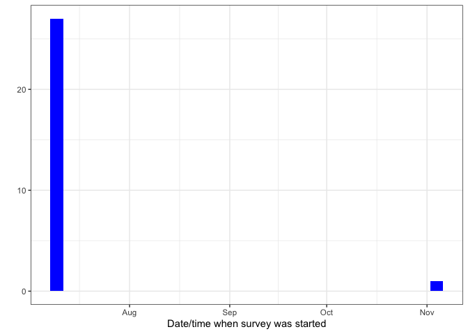<!-- -->

People took on average 127.36 minutes (median 1.48) to answer the survey.

```
#> Warning: Durations below 0 detected.
#> Warning: Removed 4 rows containing non-finite values (stat_bin).
#> Warning: Removed 2 rows containing missing values (geom_bar).
```

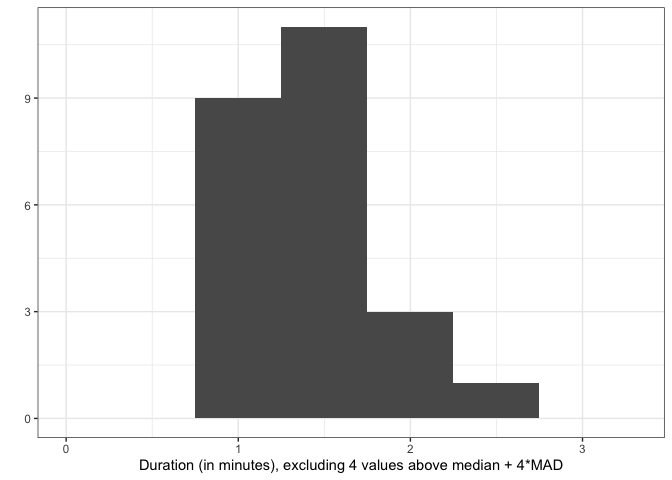<!-- -->


## Variables


### BFIK_open_2 {#BFIK_open_2 .tabset}

__Ich bin tiefsinnig, denke gerne über Sachen nach.__

#### Distribution {#BFIK_open_2_distribution}

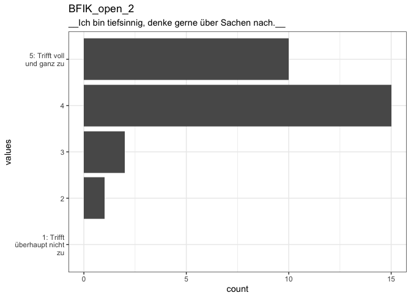<!-- -->

0 missing values.

#### Summary statistics {#BFIK_open_2_summary}

name          label                                                   data_type   ordered   value_labels                                                                                    n_missing   complete_rate   n_unique  top_counts                 
------------  ------------------------------------------------------  ----------  --------  ---------------------------------------------------------------------------------------------  ----------  --------------  ---------  ---------------------------
BFIK_open_2   __Ich bin tiefsinnig, denke gerne über Sachen nach.__   factor      FALSE     1. 1: Trifft überhaupt nicht zu,<br>2. 2,<br>3. 3,<br>4. 4,<br>5. 5: Trifft voll und ganz zu            0               1          4  4: 15, 5: : 10, 3: 2, 2: 1 


### BFIK_agree_4R {#BFIK_agree_4R .tabset}

__Ich kann mich schroff und abweisend anderen gegenüber verhalten.__

#### Distribution {#BFIK_agree_4R_distribution}

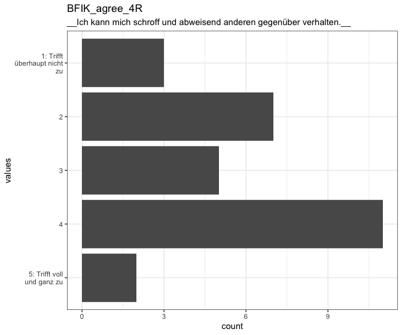<!-- -->

0 missing values.

#### Summary statistics {#BFIK_agree_4R_summary}

name            label                                                                  data_type   ordered   value_labels                                                                                    n_missing   complete_rate   n_unique  top_counts                
--------------  ---------------------------------------------------------------------  ----------  --------  ---------------------------------------------------------------------------------------------  ----------  --------------  ---------  --------------------------
BFIK_agree_4R   __Ich kann mich schroff und abweisend anderen gegenüber verhalten.__   factor      FALSE     1. 5: Trifft voll und ganz zu,<br>2. 4,<br>3. 3,<br>4. 2,<br>5. 1: Trifft überhaupt nicht zu            0               1          5  4: 11, 2: 7, 3: 5, 1: : 3 


### BFIK_extra_2 {#BFIK_extra_2 .tabset}

__Ich bin begeisterungsfähig und kann andere leicht mitreißen.__

#### Distribution {#BFIK_extra_2_distribution}

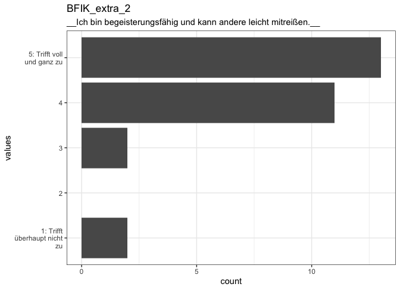<!-- -->

0 missing values.

#### Summary statistics {#BFIK_extra_2_summary}

name           label                                                              data_type   ordered   value_labels                                                                                    n_missing   complete_rate   n_unique  top_counts                   
-------------  -----------------------------------------------------------------  ----------  --------  ---------------------------------------------------------------------------------------------  ----------  --------------  ---------  -----------------------------
BFIK_extra_2   __Ich bin begeisterungsfähig und kann andere leicht mitreißen.__   factor      FALSE     1. 1: Trifft überhaupt nicht zu,<br>2. 2,<br>3. 3,<br>4. 4,<br>5. 5: Trifft voll und ganz zu            0               1          4  5: : 13, 4: 11, 1: : 2, 3: 2 


### BFIK_agree_1R {#BFIK_agree_1R .tabset}

__Ich neige dazu, andere zu kritisieren.__

#### Distribution {#BFIK_agree_1R_distribution}

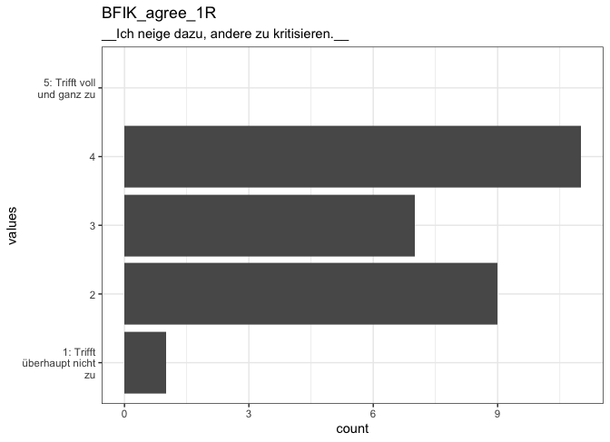<!-- -->

0 missing values.

#### Summary statistics {#BFIK_agree_1R_summary}

name            label                                        data_type   ordered   value_labels                                                                                    n_missing   complete_rate   n_unique  top_counts                
--------------  -------------------------------------------  ----------  --------  ---------------------------------------------------------------------------------------------  ----------  --------------  ---------  --------------------------
BFIK_agree_1R   __Ich neige dazu, andere zu kritisieren.__   factor      FALSE     1. 5: Trifft voll und ganz zu,<br>2. 4,<br>3. 3,<br>4. 2,<br>5. 1: Trifft überhaupt nicht zu            0               1          4  4: 11, 2: 9, 3: 7, 1: : 1 


### BFIK_open_1 {#BFIK_open_1 .tabset}

__Ich bin vielseitig interessiert.__

#### Distribution {#BFIK_open_1_distribution}

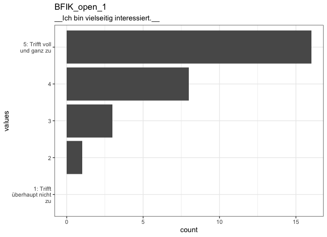<!-- -->

0 missing values.

#### Summary statistics {#BFIK_open_1_summary}

name          label                                  data_type   ordered   value_labels                                                                                    n_missing   complete_rate   n_unique  top_counts                
------------  -------------------------------------  ----------  --------  ---------------------------------------------------------------------------------------------  ----------  --------------  ---------  --------------------------
BFIK_open_1   __Ich bin vielseitig interessiert.__   factor      FALSE     1. 1: Trifft überhaupt nicht zu,<br>2. 2,<br>3. 3,<br>4. 4,<br>5. 5: Trifft voll und ganz zu            0               1          4  5: : 16, 4: 8, 3: 3, 2: 1 


### BFIK_neuro_2R {#BFIK_neuro_2R .tabset}

__Ich bin entspannt, lasse mich durch Stress nicht aus der Ruhe bringen.__

#### Distribution {#BFIK_neuro_2R_distribution}

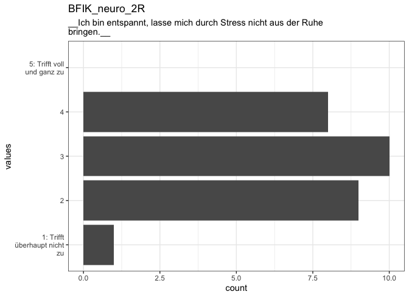<!-- -->

0 missing values.

#### Summary statistics {#BFIK_neuro_2R_summary}

name            label                                                                        data_type   ordered   value_labels                                                                                    n_missing   complete_rate   n_unique  top_counts                
--------------  ---------------------------------------------------------------------------  ----------  --------  ---------------------------------------------------------------------------------------------  ----------  --------------  ---------  --------------------------
BFIK_neuro_2R   __Ich bin entspannt, lasse mich durch Stress nicht aus der Ruhe bringen.__   factor      FALSE     1. 5: Trifft voll und ganz zu,<br>2. 4,<br>3. 3,<br>4. 2,<br>5. 1: Trifft überhaupt nicht zu            0               1          4  3: 10, 2: 9, 4: 8, 1: : 1 


### BFIK_consc_3 {#BFIK_consc_3 .tabset}

__Ich bin tüchtig und arbeite flott.__

#### Distribution {#BFIK_consc_3_distribution}

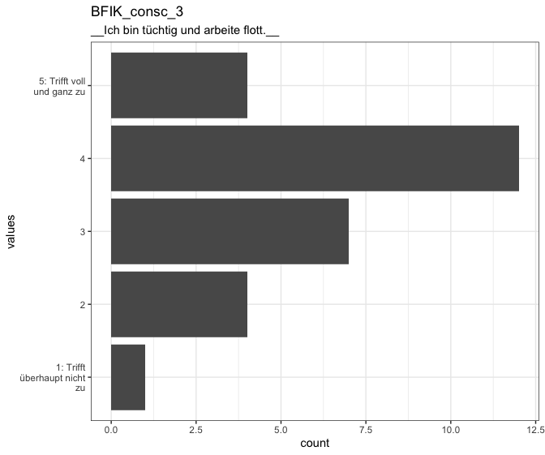<!-- -->

0 missing values.

#### Summary statistics {#BFIK_consc_3_summary}

name           label                                    data_type   ordered   value_labels                                                                                    n_missing   complete_rate   n_unique  top_counts                
-------------  ---------------------------------------  ----------  --------  ---------------------------------------------------------------------------------------------  ----------  --------------  ---------  --------------------------
BFIK_consc_3   __Ich bin tüchtig und arbeite flott.__   factor      FALSE     1. 1: Trifft überhaupt nicht zu,<br>2. 2,<br>3. 3,<br>4. 4,<br>5. 5: Trifft voll und ganz zu            0               1          5  4: 12, 3: 7, 2: 4, 5: : 4 


### BFIK_consc_4 {#BFIK_consc_4 .tabset}

__Ich mache Pläne und führe sie auch durch.__

#### Distribution {#BFIK_consc_4_distribution}

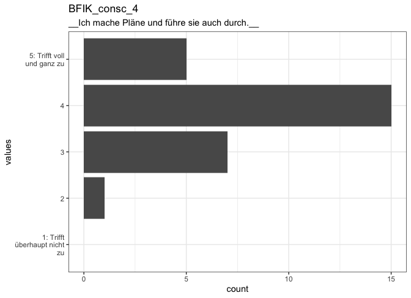<!-- -->

0 missing values.

#### Summary statistics {#BFIK_consc_4_summary}

name           label                                           data_type   ordered   value_labels                                                                                    n_missing   complete_rate   n_unique  top_counts                
-------------  ----------------------------------------------  ----------  --------  ---------------------------------------------------------------------------------------------  ----------  --------------  ---------  --------------------------
BFIK_consc_4   __Ich mache Pläne und führe sie auch durch.__   factor      FALSE     1. 1: Trifft überhaupt nicht zu,<br>2. 2,<br>3. 3,<br>4. 4,<br>5. 5: Trifft voll und ganz zu            0               1          4  4: 15, 3: 7, 5: : 5, 2: 1 


### BFIK_consc_2R {#BFIK_consc_2R .tabset}

__Ich bin bequem, neige zur Faulheit.__

#### Distribution {#BFIK_consc_2R_distribution}

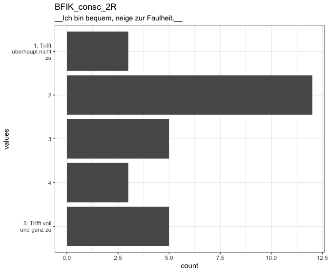<!-- -->

0 missing values.

#### Summary statistics {#BFIK_consc_2R_summary}

name            label                                     data_type   ordered   value_labels                                                                                    n_missing   complete_rate   n_unique  top_counts                
--------------  ----------------------------------------  ----------  --------  ---------------------------------------------------------------------------------------------  ----------  --------------  ---------  --------------------------
BFIK_consc_2R   __Ich bin bequem, neige zur Faulheit.__   factor      FALSE     1. 5: Trifft voll und ganz zu,<br>2. 4,<br>3. 3,<br>4. 2,<br>5. 1: Trifft überhaupt nicht zu            0               1          5  2: 12, 5: : 5, 3: 5, 4: 3 


### BFIK_agree_3R {#BFIK_agree_3R .tabset}

__Ich kann mich kalt und distanziert verhalten.__

#### Distribution {#BFIK_agree_3R_distribution}

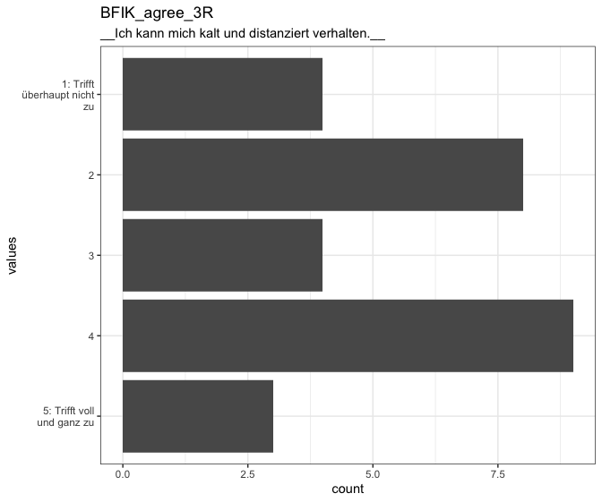<!-- -->

0 missing values.

#### Summary statistics {#BFIK_agree_3R_summary}

name            label                                               data_type   ordered   value_labels                                                                                    n_missing   complete_rate   n_unique  top_counts               
--------------  --------------------------------------------------  ----------  --------  ---------------------------------------------------------------------------------------------  ----------  --------------  ---------  -------------------------
BFIK_agree_3R   __Ich kann mich kalt und distanziert verhalten.__   factor      FALSE     1. 5: Trifft voll und ganz zu,<br>2. 4,<br>3. 3,<br>4. 2,<br>5. 1: Trifft überhaupt nicht zu            0               1          5  4: 9, 2: 8, 3: 4, 1: : 4 


### BFIK_extra_3R {#BFIK_extra_3R .tabset}

__Ich bin eher der "stille Typ", wortkarg.__

#### Distribution {#BFIK_extra_3R_distribution}

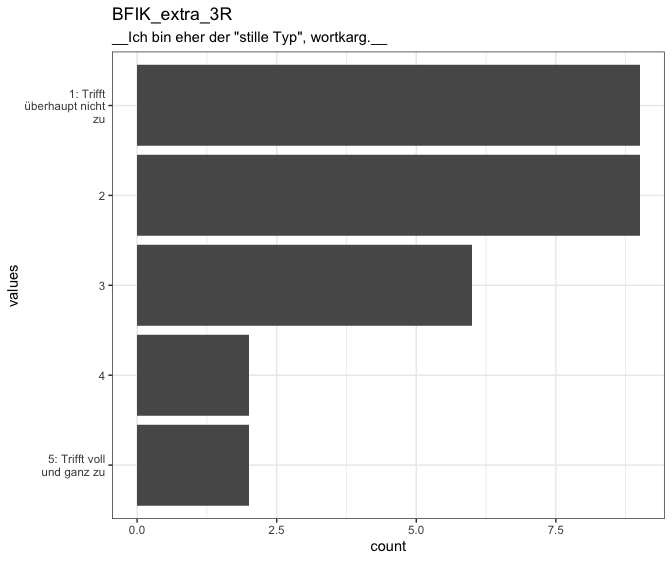<!-- -->

0 missing values.

#### Summary statistics {#BFIK_extra_3R_summary}

name            label                                          data_type   ordered   value_labels                                                                                    n_missing   complete_rate   n_unique  top_counts                 
--------------  ---------------------------------------------  ----------  --------  ---------------------------------------------------------------------------------------------  ----------  --------------  ---------  ---------------------------
BFIK_extra_3R   __Ich bin eher der "stille Typ", wortkarg.__   factor      FALSE     1. 5: Trifft voll und ganz zu,<br>2. 4,<br>3. 3,<br>4. 2,<br>5. 1: Trifft überhaupt nicht zu            0               1          5  2: 9, 1: : 9, 3: 6, 5: : 2 


### BFIK_neuro_3 {#BFIK_neuro_3 .tabset}

__Ich mache mir viele Sorgen.__

#### Distribution {#BFIK_neuro_3_distribution}

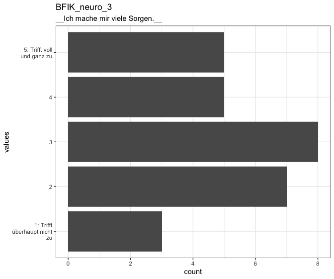<!-- -->

0 missing values.

#### Summary statistics {#BFIK_neuro_3_summary}

name           label                             data_type   ordered   value_labels                                                                                    n_missing   complete_rate   n_unique  top_counts               
-------------  --------------------------------  ----------  --------  ---------------------------------------------------------------------------------------------  ----------  --------------  ---------  -------------------------
BFIK_neuro_3   __Ich mache mir viele Sorgen.__   factor      FALSE     1. 1: Trifft überhaupt nicht zu,<br>2. 2,<br>3. 3,<br>4. 4,<br>5. 5: Trifft voll und ganz zu            0               1          5  3: 8, 2: 7, 4: 5, 5: : 5 


### BFIK_neuro_4 {#BFIK_neuro_4 .tabset}

__Ich werde leicht nervös und unsicher.__

#### Distribution {#BFIK_neuro_4_distribution}

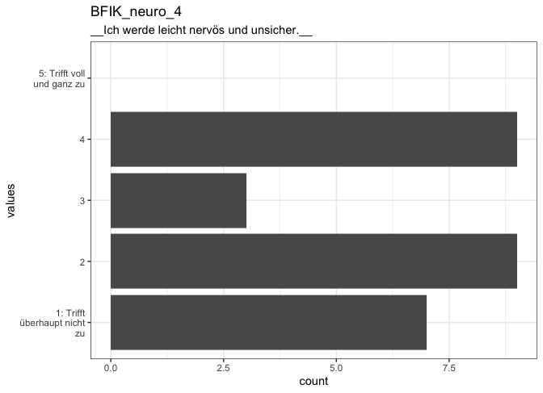<!-- -->

0 missing values.

#### Summary statistics {#BFIK_neuro_4_summary}

name           label                                       data_type   ordered   value_labels                                                                                    n_missing   complete_rate   n_unique  top_counts               
-------------  ------------------------------------------  ----------  --------  ---------------------------------------------------------------------------------------------  ----------  --------------  ---------  -------------------------
BFIK_neuro_4   __Ich werde leicht nervös und unsicher.__   factor      FALSE     1. 1: Trifft überhaupt nicht zu,<br>2. 2,<br>3. 3,<br>4. 4,<br>5. 5: Trifft voll und ganz zu            0               1          4  2: 9, 4: 9, 1: : 7, 3: 3 


### BFIK_agree_2 {#BFIK_agree_2 .tabset}

__Ich schenke anderen leicht Vertrauen, glaube an das Gute im Menschen.__

#### Distribution {#BFIK_agree_2_distribution}

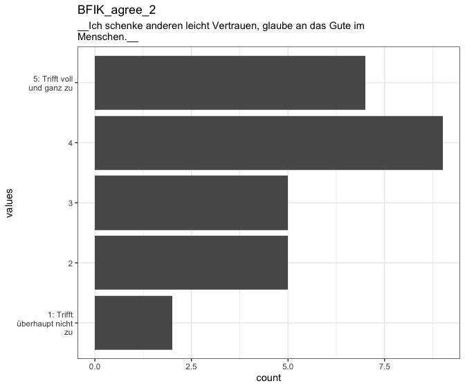<!-- -->

0 missing values.

#### Summary statistics {#BFIK_agree_2_summary}

name           label                                                                       data_type   ordered   value_labels                                                                                    n_missing   complete_rate   n_unique  top_counts               
-------------  --------------------------------------------------------------------------  ----------  --------  ---------------------------------------------------------------------------------------------  ----------  --------------  ---------  -------------------------
BFIK_agree_2   __Ich schenke anderen leicht Vertrauen, glaube an das Gute im Menschen.__   factor      FALSE     1. 1: Trifft überhaupt nicht zu,<br>2. 2,<br>3. 3,<br>4. 4,<br>5. 5: Trifft voll und ganz zu            0               1          5  4: 9, 5: : 7, 2: 5, 3: 5 


### BFIK_consc_1 {#BFIK_consc_1 .tabset}

__Ich erledige Aufgaben gründlich.__

#### Distribution {#BFIK_consc_1_distribution}

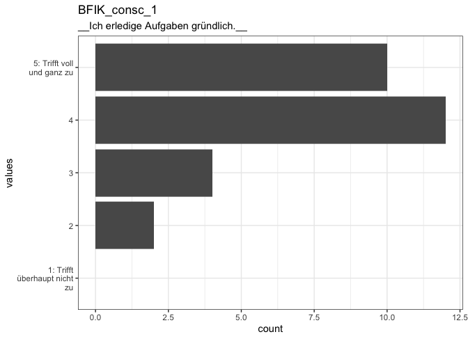<!-- -->

0 missing values.

#### Summary statistics {#BFIK_consc_1_summary}

name           label                                  data_type   ordered   value_labels                                                                                    n_missing   complete_rate   n_unique  top_counts                 
-------------  -------------------------------------  ----------  --------  ---------------------------------------------------------------------------------------------  ----------  --------------  ---------  ---------------------------
BFIK_consc_1   __Ich erledige Aufgaben gründlich.__   factor      FALSE     1. 1: Trifft überhaupt nicht zu,<br>2. 2,<br>3. 3,<br>4. 4,<br>5. 5: Trifft voll und ganz zu            0               1          4  4: 12, 5: : 10, 3: 4, 2: 2 


### BFIK_open_4 {#BFIK_open_4 .tabset}

__Ich schätze künstlerische und ästhetische Eindrücke.__

#### Distribution {#BFIK_open_4_distribution}

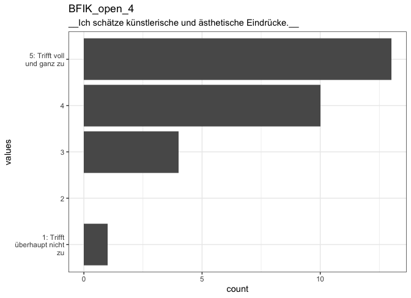<!-- -->

0 missing values.

#### Summary statistics {#BFIK_open_4_summary}

name          label                                                      data_type   ordered   value_labels                                                                                    n_missing   complete_rate   n_unique  top_counts                   
------------  ---------------------------------------------------------  ----------  --------  ---------------------------------------------------------------------------------------------  ----------  --------------  ---------  -----------------------------
BFIK_open_4   __Ich schätze künstlerische und ästhetische Eindrücke.__   factor      FALSE     1. 1: Trifft überhaupt nicht zu,<br>2. 2,<br>3. 3,<br>4. 4,<br>5. 5: Trifft voll und ganz zu            0               1          4  5: : 13, 4: 10, 3: 4, 1: : 1 


### BFIK_extra_4 {#BFIK_extra_4 .tabset}

__Ich gehe aus mir heraus, bin gesellig.__

#### Distribution {#BFIK_extra_4_distribution}

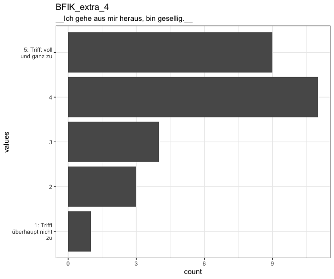<!-- -->

0 missing values.

#### Summary statistics {#BFIK_extra_4_summary}

name           label                                        data_type   ordered   value_labels                                                                                    n_missing   complete_rate   n_unique  top_counts                
-------------  -------------------------------------------  ----------  --------  ---------------------------------------------------------------------------------------------  ----------  --------------  ---------  --------------------------
BFIK_extra_4   __Ich gehe aus mir heraus, bin gesellig.__   factor      FALSE     1. 1: Trifft überhaupt nicht zu,<br>2. 2,<br>3. 3,<br>4. 4,<br>5. 5: Trifft voll und ganz zu            0               1          5  4: 11, 5: : 9, 3: 4, 2: 3 


### BFIK_extra_1R {#BFIK_extra_1R .tabset}

__Ich bin eher zurückhaltend, reserviert.__

#### Distribution {#BFIK_extra_1R_distribution}

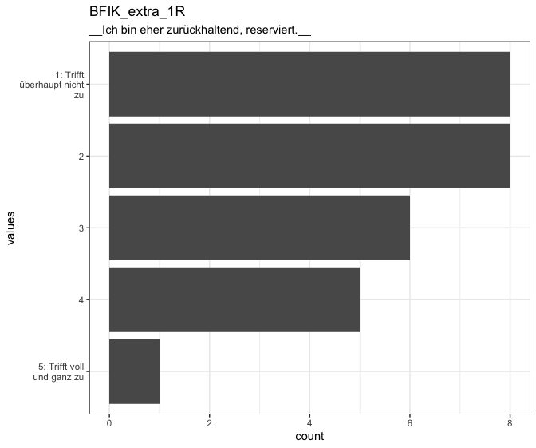<!-- -->

0 missing values.

#### Summary statistics {#BFIK_extra_1R_summary}

name            label                                         data_type   ordered   value_labels                                                                                    n_missing   complete_rate   n_unique  top_counts               
--------------  --------------------------------------------  ----------  --------  ---------------------------------------------------------------------------------------------  ----------  --------------  ---------  -------------------------
BFIK_extra_1R   __Ich bin eher zurückhaltend, reserviert.__   factor      FALSE     1. 5: Trifft voll und ganz zu,<br>2. 4,<br>3. 3,<br>4. 2,<br>5. 1: Trifft überhaupt nicht zu            0               1          5  2: 8, 1: : 8, 3: 6, 4: 5 


### BFIK_open_3 {#BFIK_open_3 .tabset}

__Ich habe eine aktive Vorstellungskraft, bin phantasievoll.__

#### Distribution {#BFIK_open_3_distribution}

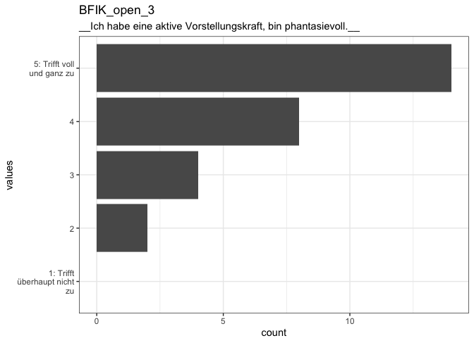<!-- -->

0 missing values.

#### Summary statistics {#BFIK_open_3_summary}

name          label                                                            data_type   ordered   value_labels                                                                                    n_missing   complete_rate   n_unique  top_counts                
------------  ---------------------------------------------------------------  ----------  --------  ---------------------------------------------------------------------------------------------  ----------  --------------  ---------  --------------------------
BFIK_open_3   __Ich habe eine aktive Vorstellungskraft, bin phantasievoll.__   factor      FALSE     1. 1: Trifft überhaupt nicht zu,<br>2. 2,<br>3. 3,<br>4. 4,<br>5. 5: Trifft voll und ganz zu            0               1          4  5: : 14, 4: 8, 3: 4, 2: 2 


### age {#age .tabset}


#### Distribution {#age_distribution}

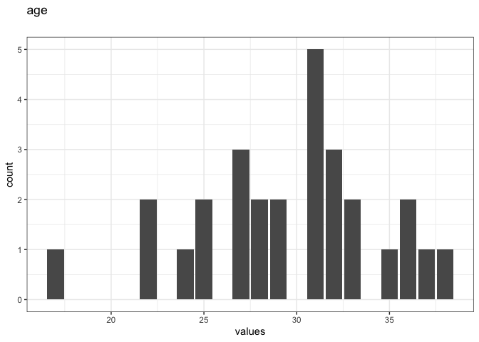<!-- -->

0 missing values.

#### Summary statistics {#age_summary}

name   data_type    n_missing   complete_rate  min   median   max        mean         sd  hist  
-----  ----------  ----------  --------------  ----  -------  ----  ---------  ---------  ------
age    numeric              0               1  17    31       38     29.60714   4.946673  ▁▃▆▇▃ 


## Missingness report

<div data-pagedtable="false">
  <script data-pagedtable-source type="application/json">
{"columns":[{"label":["description"],"name":[1],"type":["chr"],"align":["left"]},{"label":["expired"],"name":[2],"type":["dbl"],"align":["right"]},{"label":["var_miss"],"name":[3],"type":["dbl"],"align":["right"]},{"label":["n_miss"],"name":[4],"type":["dbl"],"align":["right"]}],"data":[{"1":"Missing values in 1 variables","2":"0","3":"1","4":"28"},{"1":"Missing values per variable","2":"28","3":"28","4":"28"}],"options":{"columns":{"min":{},"max":[10]},"rows":{"min":[10],"max":[10]},"pages":{}}}
  </script>
</div>


## Codebook table

<!--html_preserve--><div id="htmlwidget-44617de14437b28b8ea4" style="width:100%;height:auto;" class="datatables html-widget"></div>
<script type="application/json" data-for="htmlwidget-44617de14437b28b8ea4">{"x":{"filter":"top","filterHTML":"<tr>\n  <td data-type=\"character\" style=\"vertical-align: top;\">\n    <div class=\"form-group has-feedback\" style=\"margin-bottom: auto;\">\n      <input type=\"search\" placeholder=\"All\" class=\"form-control\" style=\"width: 100%;\"/>\n      <span class=\"glyphicon glyphicon-remove-circle form-control-feedback\"><\/span>\n    <\/div>\n  <\/td>\n  <td data-type=\"character\" style=\"vertical-align: top;\">\n    <div class=\"form-group has-feedback\" style=\"margin-bottom: auto;\">\n      <input type=\"search\" placeholder=\"All\" class=\"form-control\" style=\"width: 100%;\"/>\n      <span class=\"glyphicon glyphicon-remove-circle form-control-feedback\"><\/span>\n    <\/div>\n  <\/td>\n  <td data-type=\"character\" style=\"vertical-align: top;\">\n    <div class=\"form-group has-feedback\" style=\"margin-bottom: auto;\">\n      <input type=\"search\" placeholder=\"All\" class=\"form-control\" style=\"width: 100%;\"/>\n      <span class=\"glyphicon glyphicon-remove-circle form-control-feedback\"><\/span>\n    <\/div>\n  <\/td>\n  <td data-type=\"logical\" style=\"vertical-align: top;\">\n    <div class=\"form-group has-feedback\" style=\"margin-bottom: auto;\">\n      <input type=\"search\" placeholder=\"All\" class=\"form-control\" style=\"width: 100%;\"/>\n      <span class=\"glyphicon glyphicon-remove-circle form-control-feedback\"><\/span>\n    <\/div>\n    <div style=\"width: 100%; display: none;\">\n      <select multiple=\"multiple\" style=\"width: 100%;\" data-options=\"[&quot;true&quot;,&quot;false&quot;,&quot;na&quot;]\"><\/select>\n    <\/div>\n  <\/td>\n  <td data-type=\"character\" style=\"vertical-align: top;\">\n    <div class=\"form-group has-feedback\" style=\"margin-bottom: auto;\">\n      <input type=\"search\" placeholder=\"All\" class=\"form-control\" style=\"width: 100%;\"/>\n      <span class=\"glyphicon glyphicon-remove-circle form-control-feedback\"><\/span>\n    <\/div>\n  <\/td>\n  <td data-type=\"integer\" style=\"vertical-align: top;\">\n    <div class=\"form-group has-feedback\" style=\"margin-bottom: auto;\">\n      <input type=\"search\" placeholder=\"All\" class=\"form-control\" style=\"width: 100%;\"/>\n      <span class=\"glyphicon glyphicon-remove-circle form-control-feedback\"><\/span>\n    <\/div>\n    <div style=\"display: none; position: absolute; width: 200px;\">\n      <div data-min=\"0\" data-max=\"28\"><\/div>\n      <span style=\"float: left;\"><\/span>\n      <span style=\"float: right;\"><\/span>\n    <\/div>\n  <\/td>\n  <td data-type=\"number\" style=\"vertical-align: top;\">\n    <div class=\"form-group has-feedback\" style=\"margin-bottom: auto;\">\n      <input type=\"search\" placeholder=\"All\" class=\"form-control\" style=\"width: 100%;\"/>\n      <span class=\"glyphicon glyphicon-remove-circle form-control-feedback\"><\/span>\n    <\/div>\n    <div style=\"display: none; position: absolute; width: 200px;\">\n      <div data-min=\"0\" data-max=\"1\"><\/div>\n      <span style=\"float: left;\"><\/span>\n      <span style=\"float: right;\"><\/span>\n    <\/div>\n  <\/td>\n  <td data-type=\"integer\" style=\"vertical-align: top;\">\n    <div class=\"form-group has-feedback\" style=\"margin-bottom: auto;\">\n      <input type=\"search\" placeholder=\"All\" class=\"form-control\" style=\"width: 100%;\"/>\n      <span class=\"glyphicon glyphicon-remove-circle form-control-feedback\"><\/span>\n    <\/div>\n    <div style=\"display: none; position: absolute; width: 200px;\">\n      <div data-min=\"4\" data-max=\"28\"><\/div>\n      <span style=\"float: left;\"><\/span>\n      <span style=\"float: right;\"><\/span>\n    <\/div>\n  <\/td>\n  <td data-type=\"disabled\" style=\"vertical-align: top;\">\n    <div class=\"form-group has-feedback\" style=\"margin-bottom: auto;\">\n      <input type=\"search\" placeholder=\"All\" class=\"form-control\" style=\"width: 100%;\"/>\n      <span class=\"glyphicon glyphicon-remove-circle form-control-feedback\"><\/span>\n    <\/div>\n  <\/td>\n  <td data-type=\"character\" style=\"vertical-align: top;\">\n    <div class=\"form-group has-feedback\" style=\"margin-bottom: auto;\">\n      <input type=\"search\" placeholder=\"All\" class=\"form-control\" style=\"width: 100%;\"/>\n      <span class=\"glyphicon glyphicon-remove-circle form-control-feedback\"><\/span>\n    <\/div>\n  <\/td>\n  <td data-type=\"character\" style=\"vertical-align: top;\">\n    <div class=\"form-group has-feedback\" style=\"margin-bottom: auto;\">\n      <input type=\"search\" placeholder=\"All\" class=\"form-control\" style=\"width: 100%;\"/>\n      <span class=\"glyphicon glyphicon-remove-circle form-control-feedback\"><\/span>\n    <\/div>\n  <\/td>\n  <td data-type=\"character\" style=\"vertical-align: top;\">\n    <div class=\"form-group has-feedback\" style=\"margin-bottom: auto;\">\n      <input type=\"search\" placeholder=\"All\" class=\"form-control\" style=\"width: 100%;\"/>\n      <span class=\"glyphicon glyphicon-remove-circle form-control-feedback\"><\/span>\n    <\/div>\n  <\/td>\n  <td data-type=\"character\" style=\"vertical-align: top;\">\n    <div class=\"form-group has-feedback\" style=\"margin-bottom: auto;\">\n      <input type=\"search\" placeholder=\"All\" class=\"form-control\" style=\"width: 100%;\"/>\n      <span class=\"glyphicon glyphicon-remove-circle form-control-feedback\"><\/span>\n    <\/div>\n  <\/td>\n  <td data-type=\"character\" style=\"vertical-align: top;\">\n    <div class=\"form-group has-feedback\" style=\"margin-bottom: auto;\">\n      <input type=\"search\" placeholder=\"All\" class=\"form-control\" style=\"width: 100%;\"/>\n      <span class=\"glyphicon glyphicon-remove-circle form-control-feedback\"><\/span>\n    <\/div>\n  <\/td>\n  <td data-type=\"disabled\" style=\"vertical-align: top;\">\n    <div class=\"form-group has-feedback\" style=\"margin-bottom: auto;\">\n      <input type=\"search\" placeholder=\"All\" class=\"form-control\" style=\"width: 100%;\"/>\n      <span class=\"glyphicon glyphicon-remove-circle form-control-feedback\"><\/span>\n    <\/div>\n  <\/td>\n  <td data-type=\"disabled\" style=\"vertical-align: top;\">\n    <div class=\"form-group has-feedback\" style=\"margin-bottom: auto;\">\n      <input type=\"search\" placeholder=\"All\" class=\"form-control\" style=\"width: 100%;\"/>\n      <span class=\"glyphicon glyphicon-remove-circle form-control-feedback\"><\/span>\n    <\/div>\n  <\/td>\n  <td data-type=\"disabled\" style=\"vertical-align: top;\">\n    <div class=\"form-group has-feedback\" style=\"margin-bottom: auto;\">\n      <input type=\"search\" placeholder=\"All\" class=\"form-control\" style=\"width: 100%;\"/>\n      <span class=\"glyphicon glyphicon-remove-circle form-control-feedback\"><\/span>\n    <\/div>\n  <\/td>\n  <td data-type=\"character\" style=\"vertical-align: top;\">\n    <div class=\"form-group has-feedback\" style=\"margin-bottom: auto;\">\n      <input type=\"search\" placeholder=\"All\" class=\"form-control\" style=\"width: 100%;\"/>\n      <span class=\"glyphicon glyphicon-remove-circle form-control-feedback\"><\/span>\n    <\/div>\n  <\/td>\n<\/tr>","extensions":["Buttons"],"data":[["<a href=\"#session\">session<\/a>","<a href=\"#created\">created<\/a>","<a href=\"#modified\">modified<\/a>","<a href=\"#ended\">ended<\/a>","<a href=\"#expired\">expired<\/a>","<a href=\"#BFIK_open_2\">BFIK_open_2<\/a>","<a href=\"#BFIK_agree_4R\">BFIK_agree_4R<\/a>","<a href=\"#BFIK_extra_2\">BFIK_extra_2<\/a>","<a href=\"#BFIK_agree_1R\">BFIK_agree_1R<\/a>","<a href=\"#BFIK_open_1\">BFIK_open_1<\/a>","<a href=\"#BFIK_neuro_2R\">BFIK_neuro_2R<\/a>","<a href=\"#BFIK_consc_3\">BFIK_consc_3<\/a>","<a href=\"#BFIK_consc_4\">BFIK_consc_4<\/a>","<a href=\"#BFIK_consc_2R\">BFIK_consc_2R<\/a>","<a href=\"#BFIK_agree_3R\">BFIK_agree_3R<\/a>","<a href=\"#BFIK_extra_3R\">BFIK_extra_3R<\/a>","<a href=\"#BFIK_neuro_3\">BFIK_neuro_3<\/a>","<a href=\"#BFIK_neuro_4\">BFIK_neuro_4<\/a>","<a href=\"#BFIK_agree_2\">BFIK_agree_2<\/a>","<a href=\"#BFIK_consc_1\">BFIK_consc_1<\/a>","<a href=\"#BFIK_open_4\">BFIK_open_4<\/a>","<a href=\"#BFIK_extra_4\">BFIK_extra_4<\/a>","<a href=\"#BFIK_extra_1R\">BFIK_extra_1R<\/a>","<a href=\"#BFIK_open_3\">BFIK_open_3<\/a>","<a href=\"#age\">age<\/a>"],[null,"user first opened survey","user last edited survey","user finished survey",null,"__Ich bin tiefsinnig, denke gerne über Sachen nach.__","__Ich kann mich schroff und abweisend anderen gegenüber verhalten.__","__Ich bin begeisterungsfähig und kann andere leicht mitreißen.__","__Ich neige dazu, andere zu kritisieren.__","__Ich bin vielseitig interessiert.__","__Ich bin entspannt, lasse mich durch Stress nicht aus der Ruhe bringen.__","__Ich bin tüchtig und arbeite flott.__","__Ich mache Pläne und führe sie auch durch.__","__Ich bin bequem, neige zur Faulheit.__","__Ich kann mich kalt und distanziert verhalten.__","__Ich bin eher der \"stille Typ\", wortkarg.__","__Ich mache mir viele Sorgen.__","__Ich werde leicht nervös und unsicher.__","__Ich schenke anderen leicht Vertrauen, glaube an das Gute im Menschen.__","__Ich erledige Aufgaben gründlich.__","__Ich schätze künstlerische und ästhetische Eindrücke.__","__Ich gehe aus mir heraus, bin gesellig.__","__Ich bin eher zurückhaltend, reserviert.__","__Ich habe eine aktive Vorstellungskraft, bin phantasievoll.__",null],["character","POSIXct","POSIXct","POSIXct","logical","factor","factor","factor","factor","factor","factor","factor","factor","factor","factor","factor","factor","factor","factor","factor","factor","factor","factor","factor","numeric"],[null,null,null,null,null,false,false,false,false,false,false,false,false,false,false,false,false,false,false,false,false,false,false,false,null],[null,null,null,null,null,"1. 1: Trifft überhaupt nicht zu,<br>2. 2,<br>3. 3,<br>4. 4,<br>5. 5: Trifft voll und ganz zu","1. 5: Trifft voll und ganz zu,<br>2. 4,<br>3. 3,<br>4. 2,<br>5. 1: Trifft überhaupt nicht zu","1. 1: Trifft überhaupt nicht zu,<br>2. 2,<br>3. 3,<br>4. 4,<br>5. 5: Trifft voll und ganz zu","1. 5: Trifft voll und ganz zu,<br>2. 4,<br>3. 3,<br>4. 2,<br>5. 1: Trifft überhaupt nicht zu","1. 1: Trifft überhaupt nicht zu,<br>2. 2,<br>3. 3,<br>4. 4,<br>5. 5: Trifft voll und ganz zu","1. 5: Trifft voll und ganz zu,<br>2. 4,<br>3. 3,<br>4. 2,<br>5. 1: Trifft überhaupt nicht zu","1. 1: Trifft überhaupt nicht zu,<br>2. 2,<br>3. 3,<br>4. 4,<br>5. 5: Trifft voll und ganz zu","1. 1: Trifft überhaupt nicht zu,<br>2. 2,<br>3. 3,<br>4. 4,<br>5. 5: Trifft voll und ganz zu","1. 5: Trifft voll und ganz zu,<br>2. 4,<br>3. 3,<br>4. 2,<br>5. 1: Trifft überhaupt nicht zu","1. 5: Trifft voll und ganz zu,<br>2. 4,<br>3. 3,<br>4. 2,<br>5. 1: Trifft überhaupt nicht zu","1. 5: Trifft voll und ganz zu,<br>2. 4,<br>3. 3,<br>4. 2,<br>5. 1: Trifft überhaupt nicht zu","1. 1: Trifft überhaupt nicht zu,<br>2. 2,<br>3. 3,<br>4. 4,<br>5. 5: Trifft voll und ganz zu","1. 1: Trifft überhaupt nicht zu,<br>2. 2,<br>3. 3,<br>4. 4,<br>5. 5: Trifft voll und ganz zu","1. 1: Trifft überhaupt nicht zu,<br>2. 2,<br>3. 3,<br>4. 4,<br>5. 5: Trifft voll und ganz zu","1. 1: Trifft überhaupt nicht zu,<br>2. 2,<br>3. 3,<br>4. 4,<br>5. 5: Trifft voll und ganz zu","1. 1: Trifft überhaupt nicht zu,<br>2. 2,<br>3. 3,<br>4. 4,<br>5. 5: Trifft voll und ganz zu","1. 1: Trifft überhaupt nicht zu,<br>2. 2,<br>3. 3,<br>4. 4,<br>5. 5: Trifft voll und ganz zu","1. 5: Trifft voll und ganz zu,<br>2. 4,<br>3. 3,<br>4. 2,<br>5. 1: Trifft überhaupt nicht zu","1. 1: Trifft überhaupt nicht zu,<br>2. 2,<br>3. 3,<br>4. 4,<br>5. 5: Trifft voll und ganz zu",null],[0,0,0,0,28,0,0,0,0,0,0,0,0,0,0,0,0,0,0,0,0,0,0,0,0],[1,1,1,1,0,1,1,1,1,1,1,1,1,1,1,1,1,1,1,1,1,1,1,1,1],[28,28,28,28,null,4,5,4,4,4,4,5,4,5,5,5,5,4,5,4,4,5,5,4,null],[0,null,null,null,null,null,null,null,null,null,null,null,null,null,null,null,null,null,null,null,null,null,null,null,null],[null,null,null,null,null,"4: 15, 5: : 10, 3: 2, 2: 1","4: 11, 2: 7, 3: 5, 1: : 3","5: : 13, 4: 11, 1: : 2, 3: 2","4: 11, 2: 9, 3: 7, 1: : 1","5: : 16, 4: 8, 3: 3, 2: 1","3: 10, 2: 9, 4: 8, 1: : 1","4: 12, 3: 7, 2: 4, 5: : 4","4: 15, 3: 7, 5: : 5, 2: 1","2: 12, 5: : 5, 3: 5, 4: 3","4: 9, 2: 8, 3: 4, 1: : 4","2: 9, 1: : 9, 3: 6, 5: : 2","3: 8, 2: 7, 4: 5, 5: : 5","2: 9, 4: 9, 1: : 7, 3: 3","4: 9, 5: : 7, 2: 5, 3: 5","4: 12, 5: : 10, 3: 4, 2: 2","5: : 13, 4: 10, 3: 4, 1: : 1","4: 11, 5: : 9, 3: 4, 2: 3","2: 8, 1: : 8, 3: 6, 4: 5","5: : 14, 4: 8, 3: 4, 2: 2",null],[null,null,null,null,": ",null,null,null,null,null,null,null,null,null,null,null,null,null,null,null,null,null,null,null,null],["64","2016-07-08 09:54:16","2016-07-08 09:55:43","2016-07-08 09:55:43",null,null,null,null,null,null,null,null,null,null,null,null,null,null,null,null,null,null,null,null,"17"],[null,"2016-07-08 12:47:07","2016-07-08 14:23:22","2016-07-08 14:23:22",null,null,null,null,null,null,null,null,null,null,null,null,null,null,null,null,null,null,null,null,"31"],["64","2016-11-02 21:19:50","2016-11-02 21:21:53","2016-11-02 21:21:53",null,null,null,null,null,null,null,null,null,null,null,null,null,null,null,null,null,null,null,null,"38"],[null,null,null,null,null,null,null,null,null,null,null,null,null,null,null,null,null,null,null,null,null,null,null,null,29.6071428571429],[null,null,null,null,null,null,null,null,null,null,null,null,null,null,null,null,null,null,null,null,null,null,null,null,4.94667329824567],[0,null,null,null,null,null,null,null,null,null,null,null,null,null,null,null,null,null,null,null,null,null,null,null,null],[null,null,null,null,null,null,null,null,null,null,null,null,null,null,null,null,null,null,null,null,null,null,null,null,"▁▃▆▇▃"]],"container":"<table class=\"display\">\n  <thead>\n    <tr>\n      <th>name<\/th>\n      <th>label<\/th>\n      <th>data_type<\/th>\n      <th>ordered<\/th>\n      <th>value_labels<\/th>\n      <th>n_missing<\/th>\n      <th>complete_rate<\/th>\n      <th>n_unique<\/th>\n      <th>empty<\/th>\n      <th>top_counts<\/th>\n      <th>count<\/th>\n      <th>min<\/th>\n      <th>median<\/th>\n      <th>max<\/th>\n      <th>mean<\/th>\n      <th>sd<\/th>\n      <th>whitespace<\/th>\n      <th>hist<\/th>\n    <\/tr>\n  <\/thead>\n<\/table>","options":{"dom":"Bfrtip","buttons":["copy","csv","excel","pdf","print"],"pageLength":200,"columnDefs":[{"className":"dt-right","targets":[5,6,7,8,14,15,16]}],"order":[],"autoWidth":false,"orderClasses":false,"orderCellsTop":true,"lengthMenu":[10,25,50,100,200]}},"evals":[],"jsHooks":[]}</script><!--/html_preserve-->


<script type="application/ld+json">
{
  "name": "bfi",
  "datePublished": "2019-12-29",
  "description": "The dataset has N=28 rows and 25 columns.\n0 rows have no missing values on any column.\n\n\n## Table of variables\nThis table contains variable names, labels, their central tendencies and other attributes.\n\n|name          |label                                                                      |data_type |ordered |value_labels                                                                     | n_missing| complete_rate| n_unique| empty|top_counts                   |count |min                 |median              |max                 |     mean|       sd| whitespace|hist  |\n|:-------------|:--------------------------------------------------------------------------|:---------|:-------|:--------------------------------------------------------------------------------|---------:|-------------:|--------:|-----:|:----------------------------|:-----|:-------------------|:-------------------|:-------------------|--------:|--------:|----------:|:-----|\n|session       |NA                                                                         |character |NA      |NA                                                                               |         0|             1|       28|     0|NA                           |NA    |64                  |NA                  |64                  |       NA|       NA|          0|NA    |\n|created       |user first opened survey                                                   |POSIXct   |NA      |NA                                                                               |         0|             1|       28|    NA|NA                           |NA    |2016-07-08 09:54:16 |2016-07-08 12:47:07 |2016-11-02 21:19:50 |       NA|       NA|         NA|NA    |\n|modified      |user last edited survey                                                    |POSIXct   |NA      |NA                                                                               |         0|             1|       28|    NA|NA                           |NA    |2016-07-08 09:55:43 |2016-07-08 14:23:22 |2016-11-02 21:21:53 |       NA|       NA|         NA|NA    |\n|ended         |user finished survey                                                       |POSIXct   |NA      |NA                                                                               |         0|             1|       28|    NA|NA                           |NA    |2016-07-08 09:55:43 |2016-07-08 14:23:22 |2016-11-02 21:21:53 |       NA|       NA|         NA|NA    |\n|expired       |NA                                                                         |logical   |NA      |NA                                                                               |        28|             0|       NA|    NA|NA                           |:     |NA                  |NA                  |NA                  |      NaN|       NA|         NA|NA    |\n|BFIK_open_2   |__Ich bin tiefsinnig, denke gerne über Sachen nach.__                      |factor    |FALSE   |1. 1: Trifft überhaupt nicht zu, - 2. 2, - 3. 3, - 4. 4, - 5. 5: Trifft voll und ganz zu |         0|             1|        4|    NA|4: 15, 5: : 10, 3: 2, 2: 1   |NA    |NA                  |NA                  |NA                  |       NA|       NA|         NA|NA    |\n|BFIK_agree_4R |__Ich kann mich schroff und abweisend anderen gegenüber verhalten.__       |factor    |FALSE   |1. 5: Trifft voll und ganz zu, - 2. 4, - 3. 3, - 4. 2, - 5. 1: Trifft überhaupt nicht zu |         0|             1|        5|    NA|4: 11, 2: 7, 3: 5, 1: : 3    |NA    |NA                  |NA                  |NA                  |       NA|       NA|         NA|NA    |\n|BFIK_extra_2  |__Ich bin begeisterungsfähig und kann andere leicht mitreißen.__           |factor    |FALSE   |1. 1: Trifft überhaupt nicht zu, - 2. 2, - 3. 3, - 4. 4, - 5. 5: Trifft voll und ganz zu |         0|             1|        4|    NA|5: : 13, 4: 11, 1: : 2, 3: 2 |NA    |NA                  |NA                  |NA                  |       NA|       NA|         NA|NA    |\n|BFIK_agree_1R |__Ich neige dazu, andere zu kritisieren.__                                 |factor    |FALSE   |1. 5: Trifft voll und ganz zu, - 2. 4, - 3. 3, - 4. 2, - 5. 1: Trifft überhaupt nicht zu |         0|             1|        4|    NA|4: 11, 2: 9, 3: 7, 1: : 1    |NA    |NA                  |NA                  |NA                  |       NA|       NA|         NA|NA    |\n|BFIK_open_1   |__Ich bin vielseitig interessiert.__                                       |factor    |FALSE   |1. 1: Trifft überhaupt nicht zu, - 2. 2, - 3. 3, - 4. 4, - 5. 5: Trifft voll und ganz zu |         0|             1|        4|    NA|5: : 16, 4: 8, 3: 3, 2: 1    |NA    |NA                  |NA                  |NA                  |       NA|       NA|         NA|NA    |\n|BFIK_neuro_2R |__Ich bin entspannt, lasse mich durch Stress nicht aus der Ruhe bringen.__ |factor    |FALSE   |1. 5: Trifft voll und ganz zu, - 2. 4, - 3. 3, - 4. 2, - 5. 1: Trifft überhaupt nicht zu |         0|             1|        4|    NA|3: 10, 2: 9, 4: 8, 1: : 1    |NA    |NA                  |NA                  |NA                  |       NA|       NA|         NA|NA    |\n|BFIK_consc_3  |__Ich bin tüchtig und arbeite flott.__                                     |factor    |FALSE   |1. 1: Trifft überhaupt nicht zu, - 2. 2, - 3. 3, - 4. 4, - 5. 5: Trifft voll und ganz zu |         0|             1|        5|    NA|4: 12, 3: 7, 2: 4, 5: : 4    |NA    |NA                  |NA                  |NA                  |       NA|       NA|         NA|NA    |\n|BFIK_consc_4  |__Ich mache Pläne und führe sie auch durch.__                              |factor    |FALSE   |1. 1: Trifft überhaupt nicht zu, - 2. 2, - 3. 3, - 4. 4, - 5. 5: Trifft voll und ganz zu |         0|             1|        4|    NA|4: 15, 3: 7, 5: : 5, 2: 1    |NA    |NA                  |NA                  |NA                  |       NA|       NA|         NA|NA    |\n|BFIK_consc_2R |__Ich bin bequem, neige zur Faulheit.__                                    |factor    |FALSE   |1. 5: Trifft voll und ganz zu, - 2. 4, - 3. 3, - 4. 2, - 5. 1: Trifft überhaupt nicht zu |         0|             1|        5|    NA|2: 12, 5: : 5, 3: 5, 4: 3    |NA    |NA                  |NA                  |NA                  |       NA|       NA|         NA|NA    |\n|BFIK_agree_3R |__Ich kann mich kalt und distanziert verhalten.__                          |factor    |FALSE   |1. 5: Trifft voll und ganz zu, - 2. 4, - 3. 3, - 4. 2, - 5. 1: Trifft überhaupt nicht zu |         0|             1|        5|    NA|4: 9, 2: 8, 3: 4, 1: : 4     |NA    |NA                  |NA                  |NA                  |       NA|       NA|         NA|NA    |\n|BFIK_extra_3R |__Ich bin eher der \"stille Typ\", wortkarg.__                               |factor    |FALSE   |1. 5: Trifft voll und ganz zu, - 2. 4, - 3. 3, - 4. 2, - 5. 1: Trifft überhaupt nicht zu |         0|             1|        5|    NA|2: 9, 1: : 9, 3: 6, 5: : 2   |NA    |NA                  |NA                  |NA                  |       NA|       NA|         NA|NA    |\n|BFIK_neuro_3  |__Ich mache mir viele Sorgen.__                                            |factor    |FALSE   |1. 1: Trifft überhaupt nicht zu, - 2. 2, - 3. 3, - 4. 4, - 5. 5: Trifft voll und ganz zu |         0|             1|        5|    NA|3: 8, 2: 7, 4: 5, 5: : 5     |NA    |NA                  |NA                  |NA                  |       NA|       NA|         NA|NA    |\n|BFIK_neuro_4  |__Ich werde leicht nervös und unsicher.__                                  |factor    |FALSE   |1. 1: Trifft überhaupt nicht zu, - 2. 2, - 3. 3, - 4. 4, - 5. 5: Trifft voll und ganz zu |         0|             1|        4|    NA|2: 9, 4: 9, 1: : 7, 3: 3     |NA    |NA                  |NA                  |NA                  |       NA|       NA|         NA|NA    |\n|BFIK_agree_2  |__Ich schenke anderen leicht Vertrauen, glaube an das Gute im Menschen.__  |factor    |FALSE   |1. 1: Trifft überhaupt nicht zu, - 2. 2, - 3. 3, - 4. 4, - 5. 5: Trifft voll und ganz zu |         0|             1|        5|    NA|4: 9, 5: : 7, 2: 5, 3: 5     |NA    |NA                  |NA                  |NA                  |       NA|       NA|         NA|NA    |\n|BFIK_consc_1  |__Ich erledige Aufgaben gründlich.__                                       |factor    |FALSE   |1. 1: Trifft überhaupt nicht zu, - 2. 2, - 3. 3, - 4. 4, - 5. 5: Trifft voll und ganz zu |         0|             1|        4|    NA|4: 12, 5: : 10, 3: 4, 2: 2   |NA    |NA                  |NA                  |NA                  |       NA|       NA|         NA|NA    |\n|BFIK_open_4   |__Ich schätze künstlerische und ästhetische Eindrücke.__                   |factor    |FALSE   |1. 1: Trifft überhaupt nicht zu, - 2. 2, - 3. 3, - 4. 4, - 5. 5: Trifft voll und ganz zu |         0|             1|        4|    NA|5: : 13, 4: 10, 3: 4, 1: : 1 |NA    |NA                  |NA                  |NA                  |       NA|       NA|         NA|NA    |\n|BFIK_extra_4  |__Ich gehe aus mir heraus, bin gesellig.__                                 |factor    |FALSE   |1. 1: Trifft überhaupt nicht zu, - 2. 2, - 3. 3, - 4. 4, - 5. 5: Trifft voll und ganz zu |         0|             1|        5|    NA|4: 11, 5: : 9, 3: 4, 2: 3    |NA    |NA                  |NA                  |NA                  |       NA|       NA|         NA|NA    |\n|BFIK_extra_1R |__Ich bin eher zurückhaltend, reserviert.__                                |factor    |FALSE   |1. 5: Trifft voll und ganz zu, - 2. 4, - 3. 3, - 4. 2, - 5. 1: Trifft überhaupt nicht zu |         0|             1|        5|    NA|2: 8, 1: : 8, 3: 6, 4: 5     |NA    |NA                  |NA                  |NA                  |       NA|       NA|         NA|NA    |\n|BFIK_open_3   |__Ich habe eine aktive Vorstellungskraft, bin phantasievoll.__             |factor    |FALSE   |1. 1: Trifft überhaupt nicht zu, - 2. 2, - 3. 3, - 4. 4, - 5. 5: Trifft voll und ganz zu |         0|             1|        4|    NA|5: : 14, 4: 8, 3: 4, 2: 2    |NA    |NA                  |NA                  |NA                  |       NA|       NA|         NA|NA    |\n|age           |NA                                                                         |numeric   |NA      |NA                                                                               |         0|             1|       NA|    NA|NA                           |NA    |17                  |31                  |38                  | 29.60714| 4.946673|         NA|▁▃▆▇▃ |\n\n### Note\nThis dataset was automatically described using the [codebook R package](https://rubenarslan.github.io/codebook/) (version 0.8.2).",
  "keywords": ["session", "created", "modified", "ended", "expired", "BFIK_open_2", "BFIK_agree_4R", "BFIK_extra_2", "BFIK_agree_1R", "BFIK_open_1", "BFIK_neuro_2R", "BFIK_consc_3", "BFIK_consc_4", "BFIK_consc_2R", "BFIK_agree_3R", "BFIK_extra_3R", "BFIK_neuro_3", "BFIK_neuro_4", "BFIK_agree_2", "BFIK_consc_1", "BFIK_open_4", "BFIK_extra_4", "BFIK_extra_1R", "BFIK_open_3", "age"],
  "@context": "http://schema.org/",
  "@type": "Dataset",
  "variableMeasured": [
    {
      "name": "session",
      "@type": "propertyValue"
    },
    {
      "name": "created",
      "description": "user first opened survey",
      "@type": "propertyValue"
    },
    {
      "name": "modified",
      "description": "user last edited survey",
      "@type": "propertyValue"
    },
    {
      "name": "ended",
      "description": "user finished survey",
      "@type": "propertyValue"
    },
    {
      "name": "expired",
      "@type": "propertyValue"
    },
    {
      "name": "BFIK_open_2",
      "description": "__Ich bin tiefsinnig, denke gerne über Sachen nach.__",
      "value": "1. 1: Trifft überhaupt nicht zu,\n2. 2,\n3. 3,\n4. 4,\n5. 5: Trifft voll und ganz zu",
      "@type": "propertyValue"
    },
    {
      "name": "BFIK_agree_4R",
      "description": "__Ich kann mich schroff und abweisend anderen gegenüber verhalten.__",
      "value": "1. 5: Trifft voll und ganz zu,\n2. 4,\n3. 3,\n4. 2,\n5. 1: Trifft überhaupt nicht zu",
      "@type": "propertyValue"
    },
    {
      "name": "BFIK_extra_2",
      "description": "__Ich bin begeisterungsfähig und kann andere leicht mitreißen.__",
      "value": "1. 1: Trifft überhaupt nicht zu,\n2. 2,\n3. 3,\n4. 4,\n5. 5: Trifft voll und ganz zu",
      "@type": "propertyValue"
    },
    {
      "name": "BFIK_agree_1R",
      "description": "__Ich neige dazu, andere zu kritisieren.__",
      "value": "1. 5: Trifft voll und ganz zu,\n2. 4,\n3. 3,\n4. 2,\n5. 1: Trifft überhaupt nicht zu",
      "@type": "propertyValue"
    },
    {
      "name": "BFIK_open_1",
      "description": "__Ich bin vielseitig interessiert.__",
      "value": "1. 1: Trifft überhaupt nicht zu,\n2. 2,\n3. 3,\n4. 4,\n5. 5: Trifft voll und ganz zu",
      "@type": "propertyValue"
    },
    {
      "name": "BFIK_neuro_2R",
      "description": "__Ich bin entspannt, lasse mich durch Stress nicht aus der Ruhe bringen.__",
      "value": "1. 5: Trifft voll und ganz zu,\n2. 4,\n3. 3,\n4. 2,\n5. 1: Trifft überhaupt nicht zu",
      "@type": "propertyValue"
    },
    {
      "name": "BFIK_consc_3",
      "description": "__Ich bin tüchtig und arbeite flott.__",
      "value": "1. 1: Trifft überhaupt nicht zu,\n2. 2,\n3. 3,\n4. 4,\n5. 5: Trifft voll und ganz zu",
      "@type": "propertyValue"
    },
    {
      "name": "BFIK_consc_4",
      "description": "__Ich mache Pläne und führe sie auch durch.__",
      "value": "1. 1: Trifft überhaupt nicht zu,\n2. 2,\n3. 3,\n4. 4,\n5. 5: Trifft voll und ganz zu",
      "@type": "propertyValue"
    },
    {
      "name": "BFIK_consc_2R",
      "description": "__Ich bin bequem, neige zur Faulheit.__",
      "value": "1. 5: Trifft voll und ganz zu,\n2. 4,\n3. 3,\n4. 2,\n5. 1: Trifft überhaupt nicht zu",
      "@type": "propertyValue"
    },
    {
      "name": "BFIK_agree_3R",
      "description": "__Ich kann mich kalt und distanziert verhalten.__",
      "value": "1. 5: Trifft voll und ganz zu,\n2. 4,\n3. 3,\n4. 2,\n5. 1: Trifft überhaupt nicht zu",
      "@type": "propertyValue"
    },
    {
      "name": "BFIK_extra_3R",
      "description": "__Ich bin eher der \"stille Typ\", wortkarg.__",
      "value": "1. 5: Trifft voll und ganz zu,\n2. 4,\n3. 3,\n4. 2,\n5. 1: Trifft überhaupt nicht zu",
      "@type": "propertyValue"
    },
    {
      "name": "BFIK_neuro_3",
      "description": "__Ich mache mir viele Sorgen.__",
      "value": "1. 1: Trifft überhaupt nicht zu,\n2. 2,\n3. 3,\n4. 4,\n5. 5: Trifft voll und ganz zu",
      "@type": "propertyValue"
    },
    {
      "name": "BFIK_neuro_4",
      "description": "__Ich werde leicht nervös und unsicher.__",
      "value": "1. 1: Trifft überhaupt nicht zu,\n2. 2,\n3. 3,\n4. 4,\n5. 5: Trifft voll und ganz zu",
      "@type": "propertyValue"
    },
    {
      "name": "BFIK_agree_2",
      "description": "__Ich schenke anderen leicht Vertrauen, glaube an das Gute im Menschen.__",
      "value": "1. 1: Trifft überhaupt nicht zu,\n2. 2,\n3. 3,\n4. 4,\n5. 5: Trifft voll und ganz zu",
      "@type": "propertyValue"
    },
    {
      "name": "BFIK_consc_1",
      "description": "__Ich erledige Aufgaben gründlich.__",
      "value": "1. 1: Trifft überhaupt nicht zu,\n2. 2,\n3. 3,\n4. 4,\n5. 5: Trifft voll und ganz zu",
      "@type": "propertyValue"
    },
    {
      "name": "BFIK_open_4",
      "description": "__Ich schätze künstlerische und ästhetische Eindrücke.__",
      "value": "1. 1: Trifft überhaupt nicht zu,\n2. 2,\n3. 3,\n4. 4,\n5. 5: Trifft voll und ganz zu",
      "@type": "propertyValue"
    },
    {
      "name": "BFIK_extra_4",
      "description": "__Ich gehe aus mir heraus, bin gesellig.__",
      "value": "1. 1: Trifft überhaupt nicht zu,\n2. 2,\n3. 3,\n4. 4,\n5. 5: Trifft voll und ganz zu",
      "@type": "propertyValue"
    },
    {
      "name": "BFIK_extra_1R",
      "description": "__Ich bin eher zurückhaltend, reserviert.__",
      "value": "1. 5: Trifft voll und ganz zu,\n2. 4,\n3. 3,\n4. 2,\n5. 1: Trifft überhaupt nicht zu",
      "@type": "propertyValue"
    },
    {
      "name": "BFIK_open_3",
      "description": "__Ich habe eine aktive Vorstellungskraft, bin phantasievoll.__",
      "value": "1. 1: Trifft überhaupt nicht zu,\n2. 2,\n3. 3,\n4. 4,\n5. 5: Trifft voll und ganz zu",
      "@type": "propertyValue"
    },
    {
      "name": "age",
      "@type": "propertyValue"
    }
  ]
}
</script>

<details><summary>JSON-LD metadata</summary>
The following JSON-LD can be found by search engines, if you share this codebook
publicly on the web.

```json
{
  "name": "bfi",
  "datePublished": "2019-12-29",
  "description": "The dataset has N=28 rows and 25 columns.\n0 rows have no missing values on any column.\n\n\n## Table of variables\nThis table contains variable names, labels, their central tendencies and other attributes.\n\n|name          |label                                                                      |data_type |ordered |value_labels                                                                     | n_missing| complete_rate| n_unique| empty|top_counts                   |count |min                 |median              |max                 |     mean|       sd| whitespace|hist  |\n|:-------------|:--------------------------------------------------------------------------|:---------|:-------|:--------------------------------------------------------------------------------|---------:|-------------:|--------:|-----:|:----------------------------|:-----|:-------------------|:-------------------|:-------------------|--------:|--------:|----------:|:-----|\n|session       |NA                                                                         |character |NA      |NA                                                                               |         0|             1|       28|     0|NA                           |NA    |64                  |NA                  |64                  |       NA|       NA|          0|NA    |\n|created       |user first opened survey                                                   |POSIXct   |NA      |NA                                                                               |         0|             1|       28|    NA|NA                           |NA    |2016-07-08 09:54:16 |2016-07-08 12:47:07 |2016-11-02 21:19:50 |       NA|       NA|         NA|NA    |\n|modified      |user last edited survey                                                    |POSIXct   |NA      |NA                                                                               |         0|             1|       28|    NA|NA                           |NA    |2016-07-08 09:55:43 |2016-07-08 14:23:22 |2016-11-02 21:21:53 |       NA|       NA|         NA|NA    |\n|ended         |user finished survey                                                       |POSIXct   |NA      |NA                                                                               |         0|             1|       28|    NA|NA                           |NA    |2016-07-08 09:55:43 |2016-07-08 14:23:22 |2016-11-02 21:21:53 |       NA|       NA|         NA|NA    |\n|expired       |NA                                                                         |logical   |NA      |NA                                                                               |        28|             0|       NA|    NA|NA                           |:     |NA                  |NA                  |NA                  |      NaN|       NA|         NA|NA    |\n|BFIK_open_2   |__Ich bin tiefsinnig, denke gerne über Sachen nach.__                      |factor    |FALSE   |1. 1: Trifft überhaupt nicht zu, - 2. 2, - 3. 3, - 4. 4, - 5. 5: Trifft voll und ganz zu |         0|             1|        4|    NA|4: 15, 5: : 10, 3: 2, 2: 1   |NA    |NA                  |NA                  |NA                  |       NA|       NA|         NA|NA    |\n|BFIK_agree_4R |__Ich kann mich schroff und abweisend anderen gegenüber verhalten.__       |factor    |FALSE   |1. 5: Trifft voll und ganz zu, - 2. 4, - 3. 3, - 4. 2, - 5. 1: Trifft überhaupt nicht zu |         0|             1|        5|    NA|4: 11, 2: 7, 3: 5, 1: : 3    |NA    |NA                  |NA                  |NA                  |       NA|       NA|         NA|NA    |\n|BFIK_extra_2  |__Ich bin begeisterungsfähig und kann andere leicht mitreißen.__           |factor    |FALSE   |1. 1: Trifft überhaupt nicht zu, - 2. 2, - 3. 3, - 4. 4, - 5. 5: Trifft voll und ganz zu |         0|             1|        4|    NA|5: : 13, 4: 11, 1: : 2, 3: 2 |NA    |NA                  |NA                  |NA                  |       NA|       NA|         NA|NA    |\n|BFIK_agree_1R |__Ich neige dazu, andere zu kritisieren.__                                 |factor    |FALSE   |1. 5: Trifft voll und ganz zu, - 2. 4, - 3. 3, - 4. 2, - 5. 1: Trifft überhaupt nicht zu |         0|             1|        4|    NA|4: 11, 2: 9, 3: 7, 1: : 1    |NA    |NA                  |NA                  |NA                  |       NA|       NA|         NA|NA    |\n|BFIK_open_1   |__Ich bin vielseitig interessiert.__                                       |factor    |FALSE   |1. 1: Trifft überhaupt nicht zu, - 2. 2, - 3. 3, - 4. 4, - 5. 5: Trifft voll und ganz zu |         0|             1|        4|    NA|5: : 16, 4: 8, 3: 3, 2: 1    |NA    |NA                  |NA                  |NA                  |       NA|       NA|         NA|NA    |\n|BFIK_neuro_2R |__Ich bin entspannt, lasse mich durch Stress nicht aus der Ruhe bringen.__ |factor    |FALSE   |1. 5: Trifft voll und ganz zu, - 2. 4, - 3. 3, - 4. 2, - 5. 1: Trifft überhaupt nicht zu |         0|             1|        4|    NA|3: 10, 2: 9, 4: 8, 1: : 1    |NA    |NA                  |NA                  |NA                  |       NA|       NA|         NA|NA    |\n|BFIK_consc_3  |__Ich bin tüchtig und arbeite flott.__                                     |factor    |FALSE   |1. 1: Trifft überhaupt nicht zu, - 2. 2, - 3. 3, - 4. 4, - 5. 5: Trifft voll und ganz zu |         0|             1|        5|    NA|4: 12, 3: 7, 2: 4, 5: : 4    |NA    |NA                  |NA                  |NA                  |       NA|       NA|         NA|NA    |\n|BFIK_consc_4  |__Ich mache Pläne und führe sie auch durch.__                              |factor    |FALSE   |1. 1: Trifft überhaupt nicht zu, - 2. 2, - 3. 3, - 4. 4, - 5. 5: Trifft voll und ganz zu |         0|             1|        4|    NA|4: 15, 3: 7, 5: : 5, 2: 1    |NA    |NA                  |NA                  |NA                  |       NA|       NA|         NA|NA    |\n|BFIK_consc_2R |__Ich bin bequem, neige zur Faulheit.__                                    |factor    |FALSE   |1. 5: Trifft voll und ganz zu, - 2. 4, - 3. 3, - 4. 2, - 5. 1: Trifft überhaupt nicht zu |         0|             1|        5|    NA|2: 12, 5: : 5, 3: 5, 4: 3    |NA    |NA                  |NA                  |NA                  |       NA|       NA|         NA|NA    |\n|BFIK_agree_3R |__Ich kann mich kalt und distanziert verhalten.__                          |factor    |FALSE   |1. 5: Trifft voll und ganz zu, - 2. 4, - 3. 3, - 4. 2, - 5. 1: Trifft überhaupt nicht zu |         0|             1|        5|    NA|4: 9, 2: 8, 3: 4, 1: : 4     |NA    |NA                  |NA                  |NA                  |       NA|       NA|         NA|NA    |\n|BFIK_extra_3R |__Ich bin eher der \"stille Typ\", wortkarg.__                               |factor    |FALSE   |1. 5: Trifft voll und ganz zu, - 2. 4, - 3. 3, - 4. 2, - 5. 1: Trifft überhaupt nicht zu |         0|             1|        5|    NA|2: 9, 1: : 9, 3: 6, 5: : 2   |NA    |NA                  |NA                  |NA                  |       NA|       NA|         NA|NA    |\n|BFIK_neuro_3  |__Ich mache mir viele Sorgen.__                                            |factor    |FALSE   |1. 1: Trifft überhaupt nicht zu, - 2. 2, - 3. 3, - 4. 4, - 5. 5: Trifft voll und ganz zu |         0|             1|        5|    NA|3: 8, 2: 7, 4: 5, 5: : 5     |NA    |NA                  |NA                  |NA                  |       NA|       NA|         NA|NA    |\n|BFIK_neuro_4  |__Ich werde leicht nervös und unsicher.__                                  |factor    |FALSE   |1. 1: Trifft überhaupt nicht zu, - 2. 2, - 3. 3, - 4. 4, - 5. 5: Trifft voll und ganz zu |         0|             1|        4|    NA|2: 9, 4: 9, 1: : 7, 3: 3     |NA    |NA                  |NA                  |NA                  |       NA|       NA|         NA|NA    |\n|BFIK_agree_2  |__Ich schenke anderen leicht Vertrauen, glaube an das Gute im Menschen.__  |factor    |FALSE   |1. 1: Trifft überhaupt nicht zu, - 2. 2, - 3. 3, - 4. 4, - 5. 5: Trifft voll und ganz zu |         0|             1|        5|    NA|4: 9, 5: : 7, 2: 5, 3: 5     |NA    |NA                  |NA                  |NA                  |       NA|       NA|         NA|NA    |\n|BFIK_consc_1  |__Ich erledige Aufgaben gründlich.__                                       |factor    |FALSE   |1. 1: Trifft überhaupt nicht zu, - 2. 2, - 3. 3, - 4. 4, - 5. 5: Trifft voll und ganz zu |         0|             1|        4|    NA|4: 12, 5: : 10, 3: 4, 2: 2   |NA    |NA                  |NA                  |NA                  |       NA|       NA|         NA|NA    |\n|BFIK_open_4   |__Ich schätze künstlerische und ästhetische Eindrücke.__                   |factor    |FALSE   |1. 1: Trifft überhaupt nicht zu, - 2. 2, - 3. 3, - 4. 4, - 5. 5: Trifft voll und ganz zu |         0|             1|        4|    NA|5: : 13, 4: 10, 3: 4, 1: : 1 |NA    |NA                  |NA                  |NA                  |       NA|       NA|         NA|NA    |\n|BFIK_extra_4  |__Ich gehe aus mir heraus, bin gesellig.__                                 |factor    |FALSE   |1. 1: Trifft überhaupt nicht zu, - 2. 2, - 3. 3, - 4. 4, - 5. 5: Trifft voll und ganz zu |         0|             1|        5|    NA|4: 11, 5: : 9, 3: 4, 2: 3    |NA    |NA                  |NA                  |NA                  |       NA|       NA|         NA|NA    |\n|BFIK_extra_1R |__Ich bin eher zurückhaltend, reserviert.__                                |factor    |FALSE   |1. 5: Trifft voll und ganz zu, - 2. 4, - 3. 3, - 4. 2, - 5. 1: Trifft überhaupt nicht zu |         0|             1|        5|    NA|2: 8, 1: : 8, 3: 6, 4: 5     |NA    |NA                  |NA                  |NA                  |       NA|       NA|         NA|NA    |\n|BFIK_open_3   |__Ich habe eine aktive Vorstellungskraft, bin phantasievoll.__             |factor    |FALSE   |1. 1: Trifft überhaupt nicht zu, - 2. 2, - 3. 3, - 4. 4, - 5. 5: Trifft voll und ganz zu |         0|             1|        4|    NA|5: : 14, 4: 8, 3: 4, 2: 2    |NA    |NA                  |NA                  |NA                  |       NA|       NA|         NA|NA    |\n|age           |NA                                                                         |numeric   |NA      |NA                                                                               |         0|             1|       NA|    NA|NA                           |NA    |17                  |31                  |38                  | 29.60714| 4.946673|         NA|▁▃▆▇▃ |\n\n### Note\nThis dataset was automatically described using the [codebook R package](https://rubenarslan.github.io/codebook/) (version 0.8.2).",
  "keywords": ["session", "created", "modified", "ended", "expired", "BFIK_open_2", "BFIK_agree_4R", "BFIK_extra_2", "BFIK_agree_1R", "BFIK_open_1", "BFIK_neuro_2R", "BFIK_consc_3", "BFIK_consc_4", "BFIK_consc_2R", "BFIK_agree_3R", "BFIK_extra_3R", "BFIK_neuro_3", "BFIK_neuro_4", "BFIK_agree_2", "BFIK_consc_1", "BFIK_open_4", "BFIK_extra_4", "BFIK_extra_1R", "BFIK_open_3", "age"],
  "@context": "http://schema.org/",
  "@type": "Dataset",
  "variableMeasured": [
    {
      "name": "session",
      "@type": "propertyValue"
    },
    {
      "name": "created",
      "description": "user first opened survey",
      "@type": "propertyValue"
    },
    {
      "name": "modified",
      "description": "user last edited survey",
      "@type": "propertyValue"
    },
    {
      "name": "ended",
      "description": "user finished survey",
      "@type": "propertyValue"
    },
    {
      "name": "expired",
      "@type": "propertyValue"
    },
    {
      "name": "BFIK_open_2",
      "description": "__Ich bin tiefsinnig, denke gerne über Sachen nach.__",
      "value": "1. 1: Trifft überhaupt nicht zu,\n2. 2,\n3. 3,\n4. 4,\n5. 5: Trifft voll und ganz zu",
      "@type": "propertyValue"
    },
    {
      "name": "BFIK_agree_4R",
      "description": "__Ich kann mich schroff und abweisend anderen gegenüber verhalten.__",
      "value": "1. 5: Trifft voll und ganz zu,\n2. 4,\n3. 3,\n4. 2,\n5. 1: Trifft überhaupt nicht zu",
      "@type": "propertyValue"
    },
    {
      "name": "BFIK_extra_2",
      "description": "__Ich bin begeisterungsfähig und kann andere leicht mitreißen.__",
      "value": "1. 1: Trifft überhaupt nicht zu,\n2. 2,\n3. 3,\n4. 4,\n5. 5: Trifft voll und ganz zu",
      "@type": "propertyValue"
    },
    {
      "name": "BFIK_agree_1R",
      "description": "__Ich neige dazu, andere zu kritisieren.__",
      "value": "1. 5: Trifft voll und ganz zu,\n2. 4,\n3. 3,\n4. 2,\n5. 1: Trifft überhaupt nicht zu",
      "@type": "propertyValue"
    },
    {
      "name": "BFIK_open_1",
      "description": "__Ich bin vielseitig interessiert.__",
      "value": "1. 1: Trifft überhaupt nicht zu,\n2. 2,\n3. 3,\n4. 4,\n5. 5: Trifft voll und ganz zu",
      "@type": "propertyValue"
    },
    {
      "name": "BFIK_neuro_2R",
      "description": "__Ich bin entspannt, lasse mich durch Stress nicht aus der Ruhe bringen.__",
      "value": "1. 5: Trifft voll und ganz zu,\n2. 4,\n3. 3,\n4. 2,\n5. 1: Trifft überhaupt nicht zu",
      "@type": "propertyValue"
    },
    {
      "name": "BFIK_consc_3",
      "description": "__Ich bin tüchtig und arbeite flott.__",
      "value": "1. 1: Trifft überhaupt nicht zu,\n2. 2,\n3. 3,\n4. 4,\n5. 5: Trifft voll und ganz zu",
      "@type": "propertyValue"
    },
    {
      "name": "BFIK_consc_4",
      "description": "__Ich mache Pläne und führe sie auch durch.__",
      "value": "1. 1: Trifft überhaupt nicht zu,\n2. 2,\n3. 3,\n4. 4,\n5. 5: Trifft voll und ganz zu",
      "@type": "propertyValue"
    },
    {
      "name": "BFIK_consc_2R",
      "description": "__Ich bin bequem, neige zur Faulheit.__",
      "value": "1. 5: Trifft voll und ganz zu,\n2. 4,\n3. 3,\n4. 2,\n5. 1: Trifft überhaupt nicht zu",
      "@type": "propertyValue"
    },
    {
      "name": "BFIK_agree_3R",
      "description": "__Ich kann mich kalt und distanziert verhalten.__",
      "value": "1. 5: Trifft voll und ganz zu,\n2. 4,\n3. 3,\n4. 2,\n5. 1: Trifft überhaupt nicht zu",
      "@type": "propertyValue"
    },
    {
      "name": "BFIK_extra_3R",
      "description": "__Ich bin eher der \"stille Typ\", wortkarg.__",
      "value": "1. 5: Trifft voll und ganz zu,\n2. 4,\n3. 3,\n4. 2,\n5. 1: Trifft überhaupt nicht zu",
      "@type": "propertyValue"
    },
    {
      "name": "BFIK_neuro_3",
      "description": "__Ich mache mir viele Sorgen.__",
      "value": "1. 1: Trifft überhaupt nicht zu,\n2. 2,\n3. 3,\n4. 4,\n5. 5: Trifft voll und ganz zu",
      "@type": "propertyValue"
    },
    {
      "name": "BFIK_neuro_4",
      "description": "__Ich werde leicht nervös und unsicher.__",
      "value": "1. 1: Trifft überhaupt nicht zu,\n2. 2,\n3. 3,\n4. 4,\n5. 5: Trifft voll und ganz zu",
      "@type": "propertyValue"
    },
    {
      "name": "BFIK_agree_2",
      "description": "__Ich schenke anderen leicht Vertrauen, glaube an das Gute im Menschen.__",
      "value": "1. 1: Trifft überhaupt nicht zu,\n2. 2,\n3. 3,\n4. 4,\n5. 5: Trifft voll und ganz zu",
      "@type": "propertyValue"
    },
    {
      "name": "BFIK_consc_1",
      "description": "__Ich erledige Aufgaben gründlich.__",
      "value": "1. 1: Trifft überhaupt nicht zu,\n2. 2,\n3. 3,\n4. 4,\n5. 5: Trifft voll und ganz zu",
      "@type": "propertyValue"
    },
    {
      "name": "BFIK_open_4",
      "description": "__Ich schätze künstlerische und ästhetische Eindrücke.__",
      "value": "1. 1: Trifft überhaupt nicht zu,\n2. 2,\n3. 3,\n4. 4,\n5. 5: Trifft voll und ganz zu",
      "@type": "propertyValue"
    },
    {
      "name": "BFIK_extra_4",
      "description": "__Ich gehe aus mir heraus, bin gesellig.__",
      "value": "1. 1: Trifft überhaupt nicht zu,\n2. 2,\n3. 3,\n4. 4,\n5. 5: Trifft voll und ganz zu",
      "@type": "propertyValue"
    },
    {
      "name": "BFIK_extra_1R",
      "description": "__Ich bin eher zurückhaltend, reserviert.__",
      "value": "1. 5: Trifft voll und ganz zu,\n2. 4,\n3. 3,\n4. 2,\n5. 1: Trifft überhaupt nicht zu",
      "@type": "propertyValue"
    },
    {
      "name": "BFIK_open_3",
      "description": "__Ich habe eine aktive Vorstellungskraft, bin phantasievoll.__",
      "value": "1. 1: Trifft überhaupt nicht zu,\n2. 2,\n3. 3,\n4. 4,\n5. 5: Trifft voll und ganz zu",
      "@type": "propertyValue"
    },
    {
      "name": "age",
      "@type": "propertyValue"
    }
  ]
}`
```
</details>

